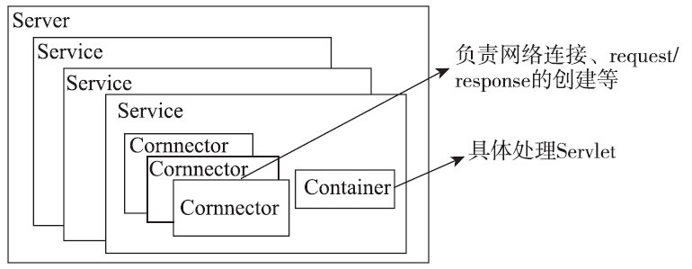

# 1.Tomcat的顶层结构及启动过程

Tomcat中最顶层的容器叫Server，代表整个服务器，Server中包含至少一个Service，用于具体提供服务。
Service主要包含两部分：Connector和Container。Connector用于处理连接相关的事情，并提供Socket与request、response的转换，
Container用于封装和管理Servlet，以及具体处理request请求。一个Tomcat中只有一个Server，一个Server可以包含多个Service，
一个Service只有一个Container，但可以有多个Connectors（因为一个服务可以有多个连接，如同时提供http和https连接，
也可以提供相同协议不同端口的连接）

Tomcat里的Server由org.apache.catalina.startup.Catalina来管理，Catalina是整个Tomcat的管理类，
它里面的三个方法load、start、stop分别用来管理整个服务器的生命周期，
load方法用于根据conf/server.xml文件创建Server并调用Server的init方法进行初始化