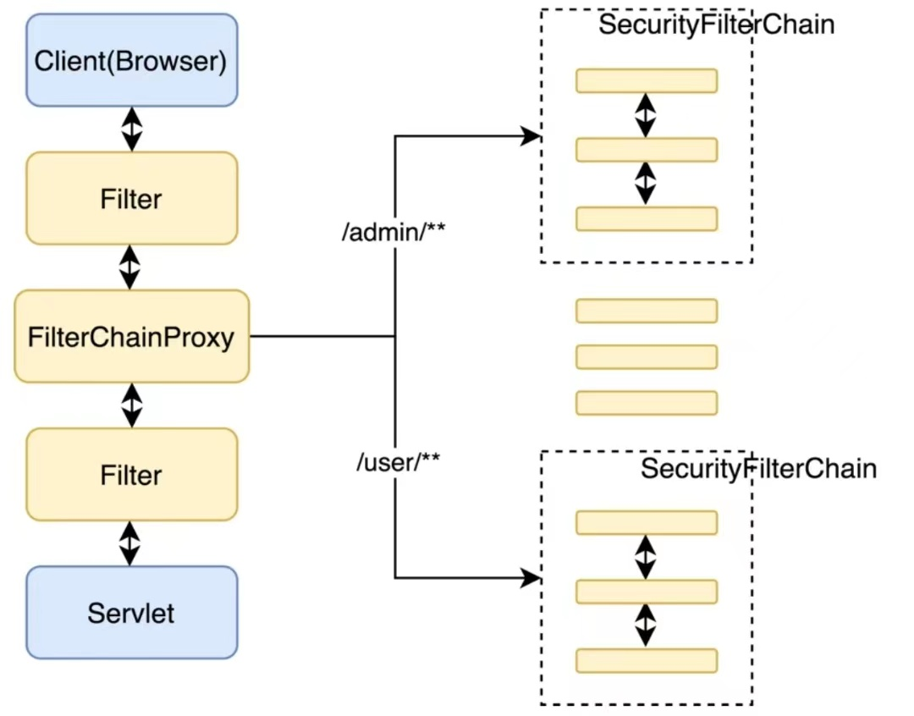

# 1.Spring Security整体架构

在Spring Security中，认证和授权是分开的，无论使用什么方式认证都不影响授权。

## 1.1认证

认证信息主要由`Authentication`的实现类来保存，接口定义如下：

```java
public interface Authentication extends Principal, Serializable {
    //获取用户权限
    Collection<? extends GrantedAuthority> getAuthorities();

    //获取用户凭证，一般来说是密码
    Object getCredentials();

    //用来获取用户携带的详细信息，可能是当前请求之类
    Object getDetails();

    //用来获取当前用户，例如用户名或者有个用户对象
    Object getPrincipal();

    //当前用户是否认证成功
    boolean isAuthenticated();

    void setAuthenticated(boolean isAuthenticated) throws IllegalArgumentException;
}
```

认证工作主要有`AuthenticationManager`接口负责，接口定义如下：

```java
public interface AuthenticationManager {
    Authentication authenticate(Authentication authentication) throws AuthenticationException;
}
```

`authenticate`方法有三个不同的返回值：

1. 返回`Authenticate`表示认证成功
2. 抛出`AuthenticationException`异常表示用户输入了无效的凭证
3. 返回null表示不能断定

主要实现类是`ProviderManager`，它管理了一个`AuthenticationProvider`集合，`AuthenticationProvider`定义如下：

```java
public interface AuthenticationProvider {
    //具体的认证方法
    Authentication authenticate(Authentication authentication) throws AuthenticationException;

    //Authentication拥有不同的实现，通过supports方法判断当前的AuthenticationProvider是否支持对应的Authentication
    boolean supports(Class<?> authentication);
}
```

在一个认证流程帐可能通过存在多个`AuthenticationProvider`（例如表单登录和短信验证码登录），通过`supports`方法判断，`ProviderManager`
具有一个可选的parent，如果所的`AuthenticationProvider`都认证失败，那么会调用parent进行认证。

## 1.2授权

相关接口：`AccessDecisionManager`，`AccessDecisionVoter`。

`AccessDecisionVoter`：投票器，检查用户是否具有应有的角色

`AccessDecisionManager`：决策器，决定此次访问是否被允许。它会挨个遍历`AccessDecisionVoter`来决定是否允许用户访问

## 1.3Web安全

在Spring Security中，认证、授权等功能都是通过过滤器来完成了的。


Spring Security通过`FilterChainProxy`嵌入到Web项目的原生过滤器链中。


并且过滤器链可能有多个



## 1.4登录数据保存

登录成功后，用户的登录信息保存到`SecurityContextHolder`中，通过`ThreadLocal`来实现（不能被其他线程访问和修改，包括子线程）。处理登录请求后，Spring
Security会将`SecurityContextHolder`中的数据保存到session中，然后清空，以后每次请求都这样，先从session中获取保存到`SecurityContextHolder`
，请求结束后重新保存在session中，然后清空`SecurityContextHolder`

如果使用`@Async`注解开启异步任务，添加如下配置就可在异步任务中通过`SecurityContextHolder`里获取用户登录信息：

```java

@Configuration
public class ApplicationConfiguration extends AsyncConfigurationSupport {
    @Override
    public Executor getAsyncExecutor() {
        return new DelegatingSecurityContextExeecutorService(Executors.newFixedThreadPool(5));
    }
}
```

# 2认证

导入依赖

```xml

<dependency>
    <groupId>org.springframework.boot</groupId>
    <artifactId>spring-boot-starter-security</artifactId>
</dependency>
<dependency>
    <groupId>org.springframework.boot</groupId>
    <artifactId>spring-boot-starter-web</artifactId>
</dependency>
```

导入依赖后会开启Spring Security的自动配置，具体如下：

    1.创建一个名为`springSecurityFilterChain`的过滤器，并注入到Spring容器中；这个过滤器负责所有的安全管理，包括用户的认证，授权，重定向到登录页等
    
    2.创建一个`UserDetailsService`实例
    
    3.给用户生成一个的登录页
    
    4.开启回话固定攻击防御
    
    5.集成X-XSS-Protection
    
    6.集成X-Frame-Options以防止单击劫持

Spring Security通过`UserDetails`接口规范用户自定义用户对象，定义如下：

```java
public interface UserDetails extends Serializable {

    Collection<? extends GrantedAuthority> getAuthorities();


    String getPassword();


    String getUsername();

    //账户是否未过期
    boolean isAccountNonExpired();
    //账号是否未锁定

    boolean isAccountNonLocked();

    //当前凭证是否为过期
    boolean isCredentialsNonExpired();

    //账户是否可用
    boolean isEnabled();
}
```

负责提供用户数据源的接口是`UserDetailsService`，定义如下：

```java
public interface UserDetailsService {
    UserDetails loadUserByUsername(String username) throws UsernameNotFoundException;
}
```

它的几个实现类如下：

- `UserDetailsManager`：是一个接口
- `JdbcDaoImpl`
- `InMemoryUserDetailsManager`：都是基于内存的操作（默认就是这）
- `JdbcUserDetailsManager`
- `CachingUserDetailsService`：会将`UserDetailsService`缓存起来
- `UserDetailsServiceDelegator`：提供了`UserDetailsService`的懒加载
- `ReactiveUserDetailsServiceAdpater`：是`webflux-web-security`模块定义的`UserDetailsService`实现

Spring Security提供了默认的登录页和注销页，都是通过过滤器生成的，`DefaultLoginPageGeneratingFilter`和`DefaultLogoutPageGeneratingFilter`
分别用来生成默认的登录页和注销页。具体逻辑可查看各自的`doFilter`方法

## 2.1基本配置

在Spring Security中，如果要自定义配置，基本上都是继承自`WebSecurityConfigurerAdapter`，示例如下：

```java

@Configuration
public class SecurityConfig extends WebSecurityConfigurerAdapter {

    @Override
    protected void configure(HttpSecurity http) throws Exception {
        http
                //开启权限配置
                .authorizeRequests()
                .anyRequest().authenticated()

                //and从新一轮配置，相当于又回到HttpSecurity
                .and()
                .formLogin()

                .loginPage("/login.html")
                .loginProcessingUrl("/doLogin")
                //配置自定义登录成功处理
                .successHandler(successHandler())
                //successForwardUrl是通过ForwardAuthenticationSuccessHandler来实现的，failureForwardUrl同样有对应的handler
                //.successForwardUrl("")
                //指定form表单提交的密码参数名
                .passwordParameter("passwd")
                //指定form表单提交的账号参数名
                .usernameParameter("uname")
                .failureUrl("/error.html")
                //permitAll表示不对以上接口拦截
                .permitAll()
                //.and()
                //.logout()
                //.logoutUrl("/logout")
                ////表示是否是session失效，默认为true
                //.invalidateHttpSession(true)
                ////表示是否清除认证信息，默认为true
                //.clearAuthentication(true)
                ////注销登录后的跳转地址
                //.logoutSuccessUrl("")
                //禁用CSRF防御功能
                .csrf().disable()
        ;
    }

    /**
     * 自定义登录成功处理
     * HttpSecurity.defaultSuccessUrl就是通过设置SavedRequestAwareAuthenticationSuccessHandler的属性来实现的
     * @return
     */
    SavedRequestAwareAuthenticationSuccessHandler successHandler() {
        SavedRequestAwareAuthenticationSuccessHandler handler = new SavedRequestAwareAuthenticationSuccessHandler();
        handler.setTargetUrlParameter("target");
        handler.setDefaultTargetUrl("/index");
        return handler;
    }

}

```

### 2.1.1登录成功配置

successForwardUrl和defaultSuccessUrl的区别

1. defaultSuccessUrl表示当前用户登录成功之后，会自动重定向到登陆之前的地址上，如果用户本身就是直接访问的登录页面，则登录成功后会重定向到defaultSuccessUrl指定的页面中
2. successForwardUrl则不会考虑用户之前的访问地址，只要用户登录成功，就会通过服务端跳转到successForwardUrl锁指定的地址

successForwardUrl和defaultSuccessUrl都是通过`AuthenticationSuccessHandler`的实例来完成，接口定义如下：

```java
public interface AuthenticationSuccessHandler {


    default void onAuthenticationSuccess(HttpServletRequest request,
                                         HttpServletResponse response, FilterChain chain, Authentication authentication)
            throws IOException, ServletException {
        onAuthenticationSuccess(request, response, authentication);
        chain.doFilter(request, response);
    }


    void onAuthenticationSuccess(HttpServletRequest request,
                                 HttpServletResponse response, Authentication authentication)
            throws IOException, ServletException;

}
```

它的三个实现类如下：

  1. `ForwardAuthenticationSuccessHandler`
     
  2. `SimpleUrlAuthenticationSuccessHandler`：通过父类`AbstractAuthenticationTargetUrlRequestHandler`的handle方法实现请求重定向
     
  3. `SavedRequestAwareAuthenticationSuccessHandler`继承自`SimpleUrlAuthenticationSuccessHandler`，
     在此基础上增加了请求缓存的功能，可记录之前请求地址，进而在登录成功后重定向到一开始访问的地址，核心方法就是`onAuthenticationSuccess`

`SavedRequestAwareAuthenticationSuccessHandler`核心代码如下：

```java
public class SavedRequestAwareAuthenticationSuccessHandler extends
        SimpleUrlAuthenticationSuccessHandler {
    protected final Log logger = LogFactory.getLog(this.getClass());

    private RequestCache requestCache = new HttpSessionRequestCache();

    @Override
    public void onAuthenticationSuccess(HttpServletRequest request,
                                        HttpServletResponse response, Authentication authentication)
            throws ServletException, IOException {
        SavedRequest savedRequest = requestCache.getRequest(request, response);

        if (savedRequest == null) {
            super.onAuthenticationSuccess(request, response, authentication);

            return;
        }
        String targetUrlParameter = getTargetUrlParameter();
        if (isAlwaysUseDefaultTargetUrl()
                || (targetUrlParameter != null && StringUtils.hasText(request
                .getParameter(targetUrlParameter)))) {
            requestCache.removeRequest(request, response);
            super.onAuthenticationSuccess(request, response, authentication);

            return;
        }

        clearAuthenticationAttributes(request);

        // Use the DefaultSavedRequest URL
        String targetUrl = savedRequest.getRedirectUrl();
        logger.debug("Redirecting to DefaultSavedRequest Url: " + targetUrl);
        getRedirectStrategy().sendRedirect(request, response, targetUrl);
    }

    public void setRequestCache(RequestCache requestCache) {
        this.requestCache = requestCache;
    }
}
```

- `targetUrlParameter`和`alwaysUseDefaultTargetUrl`

  `targetUrlParameter`是获取重定向地址参数的key，可通过调用父类的`setTargetUrlParameter`设置。

  如果`targetUrlParameter`存在或者用户设置了`alwaysUseDefaultTargetUrl`为true，则不使用缓存请求，直接调用父类的`onAuthenticationSuccess`方法

  	- `alwaysUseDefaultTargetUrl`为true，使用`defaultTargetUrl`
  	- 否则`targetUrlParameter`存在，使用`targetUrlParameter`所指定的地址

  如果前面的条件都不满足，最终会从缓存中获取重定向地址

### 2.1.2 登录失败

`failureUrl`登录失败重定向地址，是客户端重定向，不方便携带请求失败的异常信息，只能放在URL中

`failureForwardUrl`登录失败跳转地址，跳转是服务器端跳转，可携带登录异常信息

这两个配置都是通过`AuthenticationFailureHandler`接口实现，定义如下：

```java
public interface AuthenticationFailureHandler {

    void onAuthenticationFailure(HttpServletRequest request,
                                 HttpServletResponse response, AuthenticationException exception)
            throws IOException, ServletException;
}
```

实现类如下：

    1.`SimpleUrlAuthenticationFailureHandler`：`failureUrl`方法的底层逻辑就是通过该实现类实现
    2.`ExceptionMappingAuthenticationFailureHandler`：可以实现根据不同的异常类型，映射到不同路径
    3.`ForwardAuthenticationFailureHandler`：`failureForwardUrl`方法底层逻辑就是通过该实现类实现
    4.`AuthenticationEntryPointFailureHandler`：可通过`AuthenticationEntryPoint`来处理登录异常
    5.`DelegatingAuthenticationFailureHandler`：可以实现为不同的异常类型配置不同的登录失败处理回调

在前后端分离开发中，用户登录成功之后不需要返回页面，只需返回json数据，可通过自定义`AuthenticationSuccessHandler`
的实现类来完成,同样的登录失败可通过自定义`AuthenticationFailureHandler`的实现类来完成

### 2.1.3注销

注销登录可配置多个，并且可为每个请求指定请求方法：

```java

@Configuration
public class SecurityConfig extends WebSecurityConfigurerAdapter {
    @Override
    protected void configure(HttpSecurity http) throws Exception {
        InMemoryUserDetailsManager userDetailsManager = new InMemoryUserDetailsManager();
        userDetailsManager.createUser(User.withUsername("javaBoy").password("{noop}123456").roles("admin").build());
        http
                //开启权限配置
                .authorizeRequests()
                .anyRequest().authenticated()

                //and从新一轮配置
                .and()
                .formLogin()
                .loginPage("/login.html")
                .loginProcessingUrl("/doLogin")
                //配置自定义登录成功处理
                //.successHandler(successHandler())
                //successForwardUrl是通过ForwardAuthenticationSuccessHandler来实现的，failureForwardUrl同样有对应的handler
                .successForwardUrl("")
                .defaultSuccessUrl("")
                //指定form表单提交的密码参数名
                .passwordParameter("passwd")
                //指定form表单提交的账号参数名
                .usernameParameter("uname")
                .failureUrl("/error.html")
                //permitAll表示不对以上接口拦截
                .permitAll()
                .and().logout()
                .logoutRequestMatcher(new OrRequestMatcher(
                        new AntPathRequestMatcher("/logout1", "POST"),
                        new AntPathRequestMatcher("/logout2", "POST")
                ))
                //.logoutSuccessHandler((req, resp, auth) -> {
                //    resp.setContentType("application/json");
                //    resp.setStatus(200);
                //    Map<String,Object> result = new HashMap<>();
                //    result.put("msg","success");
                //    PrintWriter writer = resp.getWriter();
                //    ObjectMapper om = new ObjectMapper();
                //    writer.write(om.writeValueAsString(result));
                //})
                .defaultLogoutSuccessHandlerFor((req, resp, auth) -> {
                    //do something
                }, new AntPathRequestMatcher("/logout1", "GET"))
                .defaultLogoutSuccessHandlerFor((req, resp, auth) -> {
                    //do something
                }, new AntPathRequestMatcher("/logout2", "POST"))
                //.and()
                //.logout()
                //.logoutUrl("/logout")
                ////表示是否是session失效，默认为true
                //.invalidateHttpSession(true)
                ////表示是否清除认证信息，默认为true
                //.clearAuthentication(true)
                ////注销登录后的跳转地址
                //.logoutSuccessUrl("")
                .and().userDetailsService(userDetailsManager).csrf().disable()
        ;
    }
}
```

如果是前后端分离的项目，可通过`logoutSuccessHandler`配置返回数据格式。

对于不同的注销请求，也可以通过`defaultLogoutSuccessHandlerFor`配置

### 1.2.2 登录用户数据获取

在Spring Security中，用户登录信息本质上还是保存在HttpSession中，Spring Security对HttpSession中的用户信息进行了封装，封装之后可通过：

1. 从SecurityContextHolder中获取
2. 从当前请求对象中获取

无论通过那种方式获取，都离不开`Authentication`对象，它主要功能有：

1. 作为`AuthenticationManager`的输入参数
2. 代表已经经过身份认证的用户，此时的`Authentication`可以从`SecurityContext`中获取

```java
public interface Authentication extends Principal, Serializable {
    //获取用户权限
    Collection<? extends GrantedAuthority> getAuthorities();

    //获取用户凭证，一般来说是密码
    Object getCredentials();

    //用来获取用户携带的详细信息，可能是当前请求之类
    Object getDetails();

    //用来获取当前用户，例如用户名或者有个用户对象
    Object getPrincipal();

    //当前用户是否认证成功
    boolean isAuthenticated();

    void setAuthenticated(boolean isAuthenticated) throws IllegalArgumentException;
}
```

它的实现类如下：

- `AbstractAuthenticationToke`：实现了`Authentication`和`CredentialsContainer`接口，`CredentialsContainer`
  提供了凭证擦除方法。一般登录成功后可以将登录凭证擦除
- `RememberMeAuthenticationToken`：如果使用了RememberMe方式登录，登录信息将封装在此类中
- `TestingAuthenticationToken`：单元测试是封装的用户对象
- `AnonymousAuthenticationToken`：匿名登录时封装的用户对象
- `UsernamePasswordAuthenticationToken`：表单登录时封装的用户对象
- `RunAsUserToken`：替换验证身份时封装的用户对象
- `JaasAuthenticationToken`：JAAS认证时封装的用户对象
- `PreAuthenticatedAuthenticationToken`：Pre-Authentication场景

### 2.2.1 `SecurityContextHolder`


`SecurityContextHolder`中首先存放的时`SecurityContext`，`SecurityContextHolder`定义了三种不同`SecurityContext`的数据存放策略，常用的两种：

- `MODE_THREADLOCAL`：将SecurityContext放在`ThreadLocal`中，只有当前线程能访问
- `MODE_INHERITABLETHREADLOCAL`：将SecurityContext放在`InheritableThreadLocal`中，此策略子线程也可获取到用户登录信息

`SecurityContextHolderStrategy`接口定义：

```java
public interface SecurityContextHolderStrategy {

    void clearContext();

    SecurityContext getContext();

    void setContext(SecurityContext context);

    SecurityContext createEmptyContext();
}
```

默认的存储策略是通过`System.getProperty`加载的，所以可以通过启动参数修改：

```bash
-Dspring.security.strategy=MODE_INHERITABLETHREADLOCAL
```

### 2.2.2 `SecurityContextPersistenceFilter`

默认情况下`SecurityContextPersistenceFilter`是Spring Security过滤器链中第二道防线，位于`WebAsyncManagerIntegrationFilter`
之后，作用是为了储存`SecurityContext`。

将SecurityContext存入HttpSession，或者从HttpSession中加载数据并转为SecurityContext对象，都是由`SecurityContextRepository`
接口的实现类完成的，定义如下：

```java
public interface SecurityContextRepository {
    //加载SecurityContext对象，未登录返回一个Authentication为null的SecurityContext对象
    SecurityContext loadContext(HttpRequestResponseHolder requestResponseHolder);

    void saveContext(SecurityContext context, HttpServletRequest request, HttpServletResponse response);

    boolean containsContext(HttpServletRequest request);
}
```

Spring Security默认使用的实现类是`HttpSessionSecurityContextRepository`，此类中有两个内部类，分别是`SaveToSessionResponseWrapper`
和`SaveToSessionRequestWrapper`;
`SaveToSessionResponseWrapper`类图如下：


- `OnCommittedResponseWrapper`：当`HttpServletResponse`的`sendError`、`sendRedirect`、`flushBuffer`、`flush`以及`close`方法被调用时，
  `onResponseCommited`方法会触发

- `SaveContextOnUpdateOrErrorResponseWrapper`：继承自`OnCommittedResponseWrapper`，对`onResponseCommited`
  方法做了实现，使用变量`contextSaved`表示SecurityContext是否储存， 在调用`onResponseCommited`方法时储存SecurityContext并将`contextSaved`设置为true

- `HttpSessionSecurityContextRepository`

在此类的`saveContext`中，如果`Authentication`
为null，或者他是一个匿名对象，不保存SecurityContext；同时如果httpSession和authBeforeExecution不为null，就从httpSession中删除用户登录数据，
防止开发者在注销成功的回调中继续使用chain.doFilter方法进而导致原始的登录信息无法清除的问题

- `SaveToSessionRequestWrapper`

此类时Spring Security3.2之后出现的封装类，主要是禁止在异步Servlet提交时自动保存SecurityContext（默认子线程无法获取SecurityContext）

- `HttpSessionSecurityContextRepository`

默认使用`SPRING_SECURITY_CONTEXT_KEY`作为SecurityContext在HttpSession中储存的key，可通过`springSecurityContextKey`方法设置;

`trustResolver`是一个用户身份评估器，用来判断当前用户是匿名用户还是RememberMe登录的用户。

此类提供的功能都将在`SecurityContextPersistenceFilter`中进行调用

- `SecurityContextPersistenceFilter`

此类首先会从request中获取`FILTER_APPLIED`
的值，保证该过滤器只执行一次。当请求处理完毕后，在finally代码块中会获取最新的SecurityContext，然后清空，在调用`HttpSessionSecurityContextRepository#saveContext`方法
保存，最后移除`FILTER_APPLIED`

### 2.2.3从当前请求对象获取用户信息

在Servlet规范中提供了一些安全管理相关的方法：

1. `public String getRemoteUser();`：获取登录用户名
2. `public boolean isUserInRole()`：判断当前用户是否具备一个指定的角色
3. `public java.security.Principal getUserPrincipal()`：获取当前认证主体

一下是Servlet3.0提供的：

1. `public boolean authenticate(HttpServletResponse response)`：判断当前请求是否认证成功
2. `public void login(String username, String password)`：执行登录请求
3. `public void logout()`：执行注销操作

因为`Authentication`是`Principal`的子类，即使在Controller的请求参数是`Principal`，真实的实例依旧是`Authentication`的实例

如果使用了Spring Security框架，Controller中`HttpServletRequest`实际是`Servlet3SecurityContextHolderAwareRequestWrapper`，类图如下：


## 2.3用户定义

自定义用户就是使用`UserDetailsService`的不同实现类来提供数据，同时将配置好的`UserDetailsService`配置给`AuthenticationManagerBuilder`
，系统再将`UserDetailsService`提供给`AuthenticationProvider`使用

# 3.认证流程分析

- `AuthenticationManager`

此类是一个认证管理器，定义了Spring Security过滤器要如何执行认证操作。Spring Security默认使用的是`ProviderManager`。

```java
public interface AuthenticationManager {

    Authentication authenticate(Authentication authentication)
            throws AuthenticationException;
}

```

- `AuthenticationProvider`

此类针对不同的身份类型执行具体的身份认证

```java
public interface AuthenticationProvider {
    //执行具体的身份认证
    Authentication authenticate(Authentication authentication)
            throws AuthenticationException;

    //判断当前AuthenticationProvider是否支持对应的身份类型
    boolean supports(Class<?> authentication);
}
```

当使用用户名/密码方式登录时，对应的`AuthenticationProvider`实现类时`DaoAuthenticationProvider`，`DaoAuthenticationProvider`
继承自`AbstractUserDetailsAuthenticationProvider`
，并且没有重写`authenticate`方法，具体的认证在`AbstractUserDetailsAuthenticationProvider`方法中。

- `AbstractUserDetailsAuthenticationProvider`

此类是一个抽象类，抽象方法在`DaoAuthenticationProvider`中完成。 `AbstractUserDetailsAuthenticationProvider`核心代码如下：

```java
public abstract class AbstractUserDetailsAuthenticationProvider implements AuthenticationProvider, InitializingBean, MessageSourceAware {

    protected MessageSourceAccessor messages = SpringSecurityMessageSource.getAccessor();
    //用户缓存对象，默认不启用
    private UserCache userCache = new NullUserCache();
    //是否强制将Principal对象当成字符串来处理，默认为false，返回UserDetail实例。若为true，返回当前登录用户名
    private boolean forcePrincipalAsString = false;
    //表示是否隐藏用户名查找失败的异常，默认为true。
    protected boolean hideUserNotFoundExceptions = true;
    //用户用户状态检查，在用户认证过程中，需要检验用户状态是否正常，如账户是否被锁定、账户是否可用、账户是否过期等
    private UserDetailsChecker preAuthenticationChecks = new DefaultPreAuthenticationChecks();
    //在密码校验成功后检查密码是否过期
    private UserDetailsChecker postAuthenticationChecks = new DefaultPostAuthenticationChecks();

    private GrantedAuthoritiesMapper authoritiesMapper = new NullAuthoritiesMapper();

    //抽象方法，主要是检验密码
    protected abstract void additionalAuthenticationChecks(UserDetails userDetails, UsernamePasswordAuthenticationToken authentication) throws AuthenticationException;

    //核心方法
    public Authentication authenticate(Authentication authentication)
            throws AuthenticationException {
        Assert.isInstanceOf(UsernamePasswordAuthenticationToken.class, authentication,
                () -> messages.getMessage(
                        "AbstractUserDetailsAuthenticationProvider.onlySupports",
                        "Only UsernamePasswordAuthenticationToken is supported"));

        // Determine username
        String username = (authentication.getPrincipal() == null) ? "NONE_PROVIDED"
                : authentication.getName();

        boolean cacheWasUsed = true;
        UserDetails user = this.userCache.getUserFromCache(username);

        if (user == null) {
            cacheWasUsed = false;

            try {
                user = retrieveUser(username,
                        (UsernamePasswordAuthenticationToken) authentication);
            } catch (UsernameNotFoundException notFound) {
                logger.debug("User '" + username + "' not found");

                if (hideUserNotFoundExceptions) {
                    throw new BadCredentialsException(messages.getMessage(
                            "AbstractUserDetailsAuthenticationProvider.badCredentials",
                            "Bad credentials"));
                } else {
                    throw notFound;
                }
            }

            Assert.notNull(user,
                    "retrieveUser returned null - a violation of the interface contract");
        }

        try {
            preAuthenticationChecks.check(user);
            additionalAuthenticationChecks(user,
                    (UsernamePasswordAuthenticationToken) authentication);
        } catch (AuthenticationException exception) {
            if (cacheWasUsed) {
                // There was a problem, so try again after checking
                // we're using latest data (i.e. not from the cache)
                cacheWasUsed = false;
                user = retrieveUser(username,
                        (UsernamePasswordAuthenticationToken) authentication);
                preAuthenticationChecks.check(user);
                additionalAuthenticationChecks(user,
                        (UsernamePasswordAuthenticationToken) authentication);
            } else {
                throw exception;
            }
        }

        postAuthenticationChecks.check(user);

        if (!cacheWasUsed) {
            this.userCache.putUserInCache(user);
        }

        Object principalToReturn = user;

        if (forcePrincipalAsString) {
            principalToReturn = user.getUsername();
        }

        return createSuccessAuthentication(principalToReturn, authentication, user);
    }

}
```

- `DaoAuthenticationProvider`

代码如下：

```java
public class DaoAuthenticationProvider extends AbstractUserDetailsAuthenticationProvider {
    //查找用户失败时的默认密码
    private static final String USER_NOT_FOUND_PASSWORD = "userNotFoundPassword";
    //密码加密和对比的工具
    private PasswordEncoder passwordEncoder;
    //用户未找到时的加密密码
    private volatile String userNotFoundEncodedPassword;
    //提供用户信息
    private UserDetailsService userDetailsService;
    //提供密码修改服务
    private UserDetailsPasswordService userDetailsPasswordService;

    public DaoAuthenticationProvider() {
        setPasswordEncoder(PasswordEncoderFactories.createDelegatingPasswordEncoder());
    }

    //校验密码
    @SuppressWarnings("deprecation")
    protected void additionalAuthenticationChecks(UserDetails userDetails,
                                                  UsernamePasswordAuthenticationToken authentication)
            throws AuthenticationException {
        if (authentication.getCredentials() == null) {
            logger.debug("Authentication failed: no credentials provided");

            throw new BadCredentialsException(messages.getMessage(
                    "AbstractUserDetailsAuthenticationProvider.badCredentials",
                    "Bad credentials"));
        }

        String presentedPassword = authentication.getCredentials().toString();

        if (!passwordEncoder.matches(presentedPassword, userDetails.getPassword())) {
            logger.debug("Authentication failed: password does not match stored value");

            throw new BadCredentialsException(messages.getMessage(
                    "AbstractUserDetailsAuthenticationProvider.badCredentials",
                    "Bad credentials"));
        }
    }

    protected void doAfterPropertiesSet() {
        Assert.notNull(this.userDetailsService, "A UserDetailsService must be set");
    }

    //获取用户对象，调用UserDetailsService#loadUserByUsername方法
    protected final UserDetails retrieveUser(String username,
                                             UsernamePasswordAuthenticationToken authentication)
            throws AuthenticationException {
        prepareTimingAttackProtection();
        try {
            UserDetails loadedUser = this.getUserDetailsService().loadUserByUsername(username);
            if (loadedUser == null) {
                throw new InternalAuthenticationServiceException(
                        "UserDetailsService returned null, which is an interface contract violation");
            }
            return loadedUser;
        } catch (UsernameNotFoundException ex) {
            mitigateAgainstTimingAttack(authentication);
            throw ex;
        } catch (InternalAuthenticationServiceException ex) {
            throw ex;
        } catch (Exception ex) {
            throw new InternalAuthenticationServiceException(ex.getMessage(), ex);
        }
    }

    //在登录成功后创建一个全新的UsernamePasswordAuthenticationToken对象，同时会判断是否需要进行密码升级
    @Override
    protected Authentication createSuccessAuthentication(Object principal,
                                                         Authentication authentication, UserDetails user) {
        boolean upgradeEncoding = this.userDetailsPasswordService != null
                && this.passwordEncoder.upgradeEncoding(user.getPassword());
        if (upgradeEncoding) {
            String presentedPassword = authentication.getCredentials().toString();
            String newPassword = this.passwordEncoder.encode(presentedPassword);
            user = this.userDetailsPasswordService.updatePassword(user, newPassword);
        }
        return super.createSuccessAuthentication(principal, authentication, user);
    }

    private void prepareTimingAttackProtection() {
        if (this.userNotFoundEncodedPassword == null) {
            this.userNotFoundEncodedPassword = this.passwordEncoder.encode(USER_NOT_FOUND_PASSWORD);
        }
    }

    private void mitigateAgainstTimingAttack(UsernamePasswordAuthenticationToken authentication) {
        if (authentication.getCredentials() != null) {
            String presentedPassword = authentication.getCredentials().toString();
            this.passwordEncoder.matches(presentedPassword, this.userNotFoundEncodedPassword);
        }
    }

    public void setPasswordEncoder(PasswordEncoder passwordEncoder) {
        Assert.notNull(passwordEncoder, "passwordEncoder cannot be null");
        this.passwordEncoder = passwordEncoder;
        this.userNotFoundEncodedPassword = null;
    }

    protected PasswordEncoder getPasswordEncoder() {
        return passwordEncoder;
    }

    public void setUserDetailsService(UserDetailsService userDetailsService) {
        this.userDetailsService = userDetailsService;
    }

    protected UserDetailsService getUserDetailsService() {
        return userDetailsService;
    }

    public void setUserDetailsPasswordService(
            UserDetailsPasswordService userDetailsPasswordService) {
        this.userDetailsPasswordService = userDetailsPasswordService;
    }
}
```

在`retrieveUser`方法中，首先会调用`prepareTimingAttackProtection`方法，对常量`USER_NOT_FOUND_PASSWORD`
进行加密，然后将加密结果保存在`userNotFoundEncodedPassword`中， 当更具用户名查找用户时如果抛出了`UsernameNotFoundException`
异常，则调用`mitigateAgainstTimingAttack`方法进行密码对比，这是一个注定要失败的密码对比；主要是为了防止旁道攻击。如果根据用户名查找失败，直接抛出异常而不对比密码，那么
黑客经过大量测试就会发现有的请求小号事件明显小于其他请求，那么进而可以得出该请求的用户名是一个不存在的用户名

- `ProviderManager`

`ProviderManager`和`AuthenticationProvider`的关系如下：


Spring Security支持多种不同的认证，每一种认证对应一个`AuthenticationProvider`实例，`ProviderManager`中维护了一个`AuthenticationProvider`
List，认证的时候会遍历
`AuthenticationProvider`列表，找到对应的认证对象；

`ProviderManager`本身可以配置一个`AuthenticationManager`作为parent，当`ProviderManager`认证失败后会到parent继续认证。

`ProviderManager`也可以有多个，多个`ProviderManager`共用一个parent，当存在多个过滤器链时，不同的路径可能对应不同的认证方式，但不同的路径可能又会存在一些相同的认证方式，
这些共有的可以在parent中处理


`ProviderManager`的`authenticate`方法如下：

```java
public class ProviderManager implements AuthenticationManager, MessageSourceAware, InitializingBean {
    public Authentication authenticate(Authentication authentication)
            throws AuthenticationException {
        Class<? extends Authentication> toTest = authentication.getClass();
        //当前认证过程抛出的异常
        AuthenticationException lastException = null;
        //parent认证过程抛出的异常
        AuthenticationException parentException = null;
        //当前认证结果
        Authentication result = null;
        //parent认证结果
        Authentication parentResult = null;
        boolean debug = logger.isDebugEnabled();

        for (AuthenticationProvider provider : getProviders()) {
            //provider是否支持该实例认证
            if (!provider.supports(toTest)) {
                continue;
            }

            if (debug) {
                logger.debug("Authentication attempt using "
                        + provider.getClass().getName());
            }

            try {
                //认证
                result = provider.authenticate(authentication);

                if (result != null) {
                    copyDetails(authentication, result);
                    break;
                }
            } catch (AccountStatusException | InternalAuthenticationServiceException e) {
                prepareException(e, authentication);
                // SEC-546: Avoid polling additional providers if auth failure is due to
                // invalid account status
                throw e;
            } catch (AuthenticationException e) {
                lastException = e;
            }
        }
        //如果result没有值，说明认证失败，如果parent不为空则调用parent的认证
        if (result == null && parent != null) {
            // Allow the parent to try.
            try {
                result = parentResult = parent.authenticate(authentication);
            } catch (ProviderNotFoundException e) {
                // ignore as we will throw below if no other exception occurred prior to
                // calling parent and the parent
                // may throw ProviderNotFound even though a provider in the child already
                // handled the request
            } catch (AuthenticationException e) {
                lastException = parentException = e;
            }
        }
        //如果认证成功，擦除凭证，同时发布登录成功事件
        if (result != null) {
            if (eraseCredentialsAfterAuthentication
                    && (result instanceof CredentialsContainer)) {
                // Authentication is complete. Remove credentials and other secret data
                // from authentication
                ((CredentialsContainer) result).eraseCredentials();
            }

            // If the parent AuthenticationManager was attempted and successful than it will publish an AuthenticationSuccessEvent
            // This check prevents a duplicate AuthenticationSuccessEvent if the parent AuthenticationManager already published it
            if (parentResult == null) {
                eventPublisher.publishAuthenticationSuccess(result);
            }
            return result;
        }

        // Parent was null, or didn't authenticate (or throw an exception).
        //如果没能返回result，说明认证失败，lastException为null说明parent为null或者没有认证或者认证失败但是没有抛出异常
        if (lastException == null) {
            lastException = new ProviderNotFoundException(messages.getMessage(
                    "ProviderManager.providerNotFound",
                    new Object[]{toTest.getName()},
                    "No AuthenticationProvider found for {0}"));
        }

        // If the parent AuthenticationManager was attempted and failed than it will publish an AbstractAuthenticationFailureEvent
        // This check prevents a duplicate AbstractAuthenticationFailureEvent if the parent AuthenticationManager already published it
        //发布认证失败事件
        if (parentException == null) {
            prepareException(lastException, authentication);
        }

        throw lastException;
    }

}
```

- `AbstractAuthenticationProcessingFilter`

`AbstractAuthenticationProcessingFilter`工作流程：


此类是一个抽象类，默认实例是`UsernamePasswordAuthenticationFilter`，构造出来的`Authentication`实例则是`UsernamePasswordAuthenticationToken`。

细化之后的流程图：


认证大致流程：

1.用户提交登录请求，`UsernamePasswordAuthenticationFilter`从当前请求提取用户名密码，创建`UsernamePasswordAuthenticationToken`对象

2.将`UsernamePasswordAuthenticationToken`对象传入`ProviderManager`中进行具体认证（在`UsernamePasswordAuthenticationFilter`中）

3.如果认证失败，则SecurityContextHolder中相关信息将被清除，登录失败回调也会被调用

4.如果认证成功，则会进行登录信息储存、session并发处理、登录成功事件发布以及登录成功方法回调等操作

`AbstractAuthenticationProcessingFilter`相关代码：

```java
public abstract class AbstractAuthenticationProcessingFilter extends GenericFilterBean implements ApplicationEventPublisherAware, MessageSourceAware {
    public void doFilter(ServletRequest req, ServletResponse res, FilterChain chain)
            throws IOException, ServletException {

        HttpServletRequest request = (HttpServletRequest) req;
        HttpServletResponse response = (HttpServletResponse) res;
        //如果当前请求不需要认证，直接继续走剩下过滤器
        if (!requiresAuthentication(request, response)) {
            chain.doFilter(request, response);
            return;
        }

        if (logger.isDebugEnabled()) {
            logger.debug("Request is to process authentication");
        }

        Authentication authResult;

        try {
            //获取一个结果认证过的认证对象，为抽象方法，具体实现在UsernamePasswordAuthenticationFilter中
            authResult = attemptAuthentication(request, response);
            if (authResult == null) {
                // return immediately as subclass has indicated that it hasn't completed
                // authentication
                return;
            }
            //处理session并发问题
            sessionStrategy.onAuthentication(authResult, request, response);
        } catch (InternalAuthenticationServiceException failed) {
            logger.error(
                    "An internal error occurred while trying to authenticate the user.",
                    failed);
            //认证失败
            unsuccessfulAuthentication(request, response, failed);

            return;
        } catch (AuthenticationException failed) {
            // Authentication failed
            //认证失败
            unsuccessfulAuthentication(request, response, failed);

            return;
        }

        // Authentication success
        //认证成功后是否继续走下去，默认为false
        if (continueChainBeforeSuccessfulAuthentication) {
            chain.doFilter(request, response);
        }
        //登录成功
        successfulAuthentication(request, response, chain, authResult);
    }
}
```

`unsuccessfulAuthentication`方法：

1. 从`SecurityContextHolder`中清除数据

2. 清除Cookie等信息

3. 调用认证失败回调方法

`successfulAuthentication`方法：

  1. 向`SecurityContextHolder`存入用户信息
  
  2. 处理Cookie
  
  3. 发布认证成功事件
  
  4. 调用认证成功回调

`AbstractAuthenticationProcessingFilter`实例`UsernamePasswordAuthenticationFilter`最核心的方法为`attemptAuthentication`
，在此方法中，通过当前请求参数 构建`UsernamePasswordAuthenticationToken`对象，然后调用`ProviderManager`的`authentication`方法

## 3.1配置多个数据源

认证要经过`AuthenticationProvider`，每一个`AuthenticationProvider`中都配置了一个`UserDetailsService`，而不同的`UserDetailsService`代表不同的数据源。
只要配置多个`AuthenticationProvider`，并提供不同的`UserDetailsService`即可实现多个数据源。

`AuthenticationProvider`由`ProviderManager`管理，只需重写`WebSecurityConfigurerAdapter`的`authenticationManagerBean`
方法，为`ProviderManager`设置 多个`AuthenticationProvider`即可

## 3.2添加登录验证码

实现登录验证码的思路：

1.自定义过滤器

2.自定义认证逻辑

身份认证实际上是在`Authenticationprovider#authenticate`方法中完成；验证码的教研可以在该方法执行之前进行，实例如下：

```java
public class CaptchaAuthenticationProvider extends DaoAuthenticationProvider {
    @Override
    public Authentication authenticate(Authentication authentication) throws AuthenticationException {
        HttpServletRequest request = ((ServletRequestAttributes) RequestContextHolder.currentRequestAttributes()).getRequest();
        String captcha = request.getParameter("captcha");
        String sessionCaptcha = (String) request.getSession().getAttribute("captcha");
        if (captcha != null && sessionCaptcha != null && captcha.equals(sessionCaptcha)) {
            return super.authenticate(authentication);
        }
        throw new AuthenticationServiceException("验证码错误！");
    }
}
```

验证码生成后可以存放在session中，校验时再取出来。在执行认证前校验验证码，可以避免数据库的查询；最后在`SecurityConfig`中配置`AuthenticationManager`，主要代码如下：

```java

@Configuration
public class SecurityConfig extends WebSecurityConfigurerAdapter {
    @Bean
    AuthenticationProvider captchaAuthenticationProvider() {
        CaptchaAuthenticationProvider provider = new CaptchaAuthenticationProvider();
        //TODO 设置数据源
        //provider.setUserDetailsService(数据源);
        return provider;
    }

    @Bean
    @Override
    public AuthenticationManager authenticationManagerBean() throws Exception {
        ProviderManager providerManager = new ProviderManager(captchaAuthenticationProvider());
        return providerManager;
    }
}
```

# 4.过滤器链分析

## 4.1主要类说明

### 4.1.1 `ObjectPostProcessor`

`ObjectPostProcessor`是一个对象后置处理器，接口定义如下：

```java
public interface ObjectPostProcessor<T> {
    <O extends T> O postProcess(O object);
}
```

它有两个实现类，分别是`AutowireBeanFactoryObjectPostProcessor`和`CompositeObjectPostProcessor`

- `AutowireBeanFactoryObjectPostProcessor`

由于Spring Security中大量采用了java配置，许多对象都是直接new出来的，不会自动注入到Spring容器中，`AutowireBeanFactoryObjectPostProcessor`所承担的就是在一个对象
new出来之后只要调用`AutowireBeanFactoryObjectPostProcessor#postProcessor`方法，就可以成功注入到Spring容器中，原理是通过调用Spring容器中的
`AutowireCapableBeanFactory`对象完成的

- `CompositeObjectPostProcessor`

一个对象可以有一个后置处理器，开发者也可以自定义多个对象后置处理器。`CompositeObjectPostProcessor`中维护了一个后置处理器List集合。在Spring Security中，最终使用的对象
后置处理器就是它，它集合默认只有 一个`AutowireBeanFactoryObjectPostProcessor`

一旦选定过滤器之后，每一个过滤器都会有一个对应配置类，叫作`xxxConfigurer`，例如`CorsConfigurer`、`CsrfConfigurer`

### 4.1.2 `SecurityFilterChain`

`SecurityFilterChain`就是Spring Security中的过滤器对象，代码如下：

```java
public interface SecurityFilterChain {
    //判断request请求是否应该被当前过滤器处理
    boolean matches(HttpServletRequest request);

    //如果matches返回true，request请求就会在getFilters方法返回的Filter集合中被处理
    List<Filter> getFilters();
}
```

它只有一个默认的实现类`DefaultSecurityFilterChain`，代码如下：

```java
public final class DefaultSecurityFilterChain implements SecurityFilterChain {
    private static final Log logger = LogFactory.getLog(DefaultSecurityFilterChain.class);
    private final RequestMatcher requestMatcher;
    private final List<Filter> filters;

    public DefaultSecurityFilterChain(RequestMatcher requestMatcher, Filter... filters) {
        this(requestMatcher, Arrays.asList(filters));
    }

    public DefaultSecurityFilterChain(RequestMatcher requestMatcher, List<Filter> filters) {
        logger.info("Creating filter chain: " + requestMatcher + ", " + filters);
        this.requestMatcher = requestMatcher;
        this.filters = new ArrayList<>(filters);
    }

    public RequestMatcher getRequestMatcher() {
        return requestMatcher;
    }

    public List<Filter> getFilters() {
        return filters;
    }

    public boolean matches(HttpServletRequest request) {
        return requestMatcher.matches(request);
    }

    @Override
    public String toString() {
        return "[ " + requestMatcher + ", " + filters + "]";
    }
}
```

需要注意的是，在Spring Security中，SecurityFilterChain的实例可能有多个

### 4.1.3 `SecurityBuilder`

Spring Security中所有需要构建的对象都可以通过`SecurityBuilder`来实现，默认的过滤器、代理过滤器、`AuthenticationManager`等，代码如下：

```java
public interface SecurityBuilder<O> {
    O build() throws Exception;
}
```

不同的`SecurityBuilder`会构建出不同的对象

- `HttpSecurityBulider`

`HttpSecurityBulider`是用来构建HttpSecurity对象的，代码如下：

```java

public interface HttpSecurityBuilder<H extends HttpSecurityBuilder<H>> extends SecurityBuilder<DefaultSecurityFilterChain> {
    //获取一个配置器
    <C extends SecurityConfigurer<DefaultSecurityFilterChain, H>> C getConfigurer(Class<C> clazz);

    //移除一个配置器
    <C extends SecurityConfigurer<DefaultSecurityFilterChain, H>> C removeConfigurer(Class<C> clazz);

    //设置一个可以在多个配置器之间共享的对象
    <C> void setSharedObject(Class<C> sharedType, C object);

    //获取一个可以在多个配置器之间共享的对象
    <C> C getSharedObject(Class<C> sharedType);

    //配置一个认证器
    H authenticationProvider(AuthenticationProvider authenticationProvider);

    //配置一个数据源
    H userDetailsService(UserDetailsService userDetailsService) throws Exception;

    //表示在某一个过滤器之后添加一个过滤器
    H addFilterAfter(Filter filter, Class<? extends Filter> afterFilter);

    //表示在某一个过滤器之前添加一个过滤器
    H addFilterBefore(Filter filter, Class<? extends Filter> beforeFilter);

    //添加一个过滤器，这过滤器必须是Spring Security框架体哦概念股的过滤器的一个实例或拓展，添加完后会自动进行排序
    H addFilter(Filter filter);
}
```

默认情况下该类的实现类只有一个`HttpSecurity`，所以可以把代码中的H当作`HttpSecurity`来来理解。

定义中指定了`SecurityBuilder`的泛型为`DefaultSecurityFilterChain`，所以`HttpSecurityBuilder`最终想要构建的对象是`DefaultSecurityFilterChain`

- `AbstractSecurityBuilder`

此抽象类实现了`SecurityBulider`接口，主要功能是确保目标对象只build一次，具体的构建过程则有子类完成

- `AbstractConfiguredSecrityBulider`

此类实现了`doBuild`方法，并且在类中声明了一个枚举类，描述构建过程的不同状态，分别是：

1.UNBUILT

2.INITIALIZING

3.CONFIGURING

4.BUILDING

5.BUILT

在`doBuild`方法中一边更新构建状态，一边执行构建方法，构建代码如下：

```java
public abstract class AbstractConfiguredSecurityBuilder<O, B extends SecurityBuilder<O>> extends AbstractSecurityBuilder<O> {
    @Override
    protected final O doBuild() throws Exception {
        synchronized (configurers) {
            buildState = BuildState.INITIALIZING;
            //空方法，如果在初始化之前需要做一些准备工作，可重写此方法
            beforeInit();
            //所有配置类的初始化方法，在此方法中遍历所有配置类，并调用其init方法
            init();

            buildState = BuildState.CONFIGURING;
            //空方法
            beforeConfigure();
            //完成所有的配置类，调用其configure方法完成
            configure();

            buildState = BuildState.BUILDING;
            //抽象方法，最终的构建方法
            O result = performBuild();

            buildState = BuildState.BUILT;

            return result;
        }
    }
}
```

- `ProviderManagerBuilder`

`ProviderManagerBuilder`构建的对象是`AuthenticationManager`，代码如下：

```java
public interface ProviderManagerBuilder<B extends ProviderManagerBuilder<B>> extends SecurityBuilder<AuthenticationManager> {
	
	B authenticationProvider(AuthenticationProvider authenticationProvider);
}
```

- `AuthenticationManagerBuilder`

`AuthenticationManagerBuilder`继承`AbstractConfiguredSecurityBuilder`，自实现了`ProviderManagerBuilder`。它的构造方法有两个参数，一个是对象后置处理器，一个是是否允许相同类型的配置同时存在，
他这里是允许的。

在此类中，`authenticatinProvider`方法添加多个`AuthenticationProvider`实例；

`performBuild`方法执行具体的构建工作，这里构建的实例就是`ProviderManager`对象，并配置`AuthenticationProvider`集合和parent `AuthenticationManager`对象，然后调用对象后置处理器的方法，将构建的`ProviderManager`添加到Spring容器中

- `HttpSecurity`

此类主要作用是构建一条过滤器链--`DefaultSecurityFilterChain`对象。一个`DefaultSecurityFilterChain`对象包含一个路径匹配器和多个Spring Security过滤器，`HttpSecurity`收集各种各样的`xxxConfigurer`，将Spring Security过滤器对应的
配置类收集起来，并保存到父类`AbstractConfiguredSecurityBuilder`的configurers变量中，在后续的构建过程中，再将这写`xxxConfigurer`构建为具体的Spring Security过滤器，同时添加到`HttpSecurity`的filter对象中

- `WebSecurity`

一个`HttpSecurity`对象可以构建一个过滤器链，也就是一个`DefaultSecurityFilterChain`对象，而一个项目中可以存在多个`HttpSecurity`对象，
也就可以构建多个`DefaultSecurityFilterChain`。

`WebSecurity`负责将`HttpSecurity`所构建的`DefaultSecurityFilterChain`以及其他一些需要忽略的请求，再次重新构建为一个`FilterChainProxy`对象，
同时加上HTTP防火墙。代码如下：

```java
public final class WebSecurity extends AbstractConfiguredSecurityBuilder<Filter, WebSecurity> implements SecurityBuilder<Filter>, ApplicationContextAware {
	private final Log logger = LogFactory.getLog(getClass());
    //保存了所有被忽略的请求；在实际项目中，并非所有的请求都要经过Spring Security的过滤器链，比如一些静态资源
	private final List<RequestMatcher> ignoredRequests = new ArrayList<>();
    //保存所有的HttpSecurity对象，每个HttpSecurity创建成功后，通过addSecurityFilterChainBuilder方法添加
	private final List<SecurityBuilder<? extends SecurityFilterChain>> securityFilterChainBuilders = new ArrayList<>();

	private IgnoredRequestConfigurer ignoredRequestRegistry;

	private FilterSecurityInterceptor filterSecurityInterceptor;
    //配置请求防火墙
	private HttpFirewall httpFirewall;

	private boolean debugEnabled;

	private WebInvocationPrivilegeEvaluator privilegeEvaluator;

	private DefaultWebSecurityExpressionHandler defaultWebSecurityExpressionHandler = new DefaultWebSecurityExpressionHandler();

	private SecurityExpressionHandler<FilterInvocation> expressionHandler = defaultWebSecurityExpressionHandler;

	private Runnable postBuildAction = () -> {
	};

	public WebSecurity(ObjectPostProcessor<Object> objectPostProcessor) {
		super(objectPostProcessor);
	}

	public IgnoredRequestConfigurer ignoring() {
		return ignoredRequestRegistry;
	}

	public WebSecurity httpFirewall(HttpFirewall httpFirewall) {
		this.httpFirewall = httpFirewall;
		return this;
	}

	public WebSecurity debug(boolean debugEnabled) {
		this.debugEnabled = debugEnabled;
		return this;
	}

	public WebSecurity addSecurityFilterChainBuilder(
			SecurityBuilder<? extends SecurityFilterChain> securityFilterChainBuilder) {
		this.securityFilterChainBuilders.add(securityFilterChainBuilder);
		return this;
	}

	public WebSecurity privilegeEvaluator(WebInvocationPrivilegeEvaluator privilegeEvaluator) {
		this.privilegeEvaluator = privilegeEvaluator;
		return this;
	}

	public WebSecurity expressionHandler(
			SecurityExpressionHandler<FilterInvocation> expressionHandler) {
		Assert.notNull(expressionHandler, "expressionHandler cannot be null");
		this.expressionHandler = expressionHandler;
		return this;
	}

	public SecurityExpressionHandler<FilterInvocation> getExpressionHandler() {
		return expressionHandler;
	}

	public WebInvocationPrivilegeEvaluator getPrivilegeEvaluator() {
		if (privilegeEvaluator != null) {
			return privilegeEvaluator;
		}
		return filterSecurityInterceptor == null ? null
				: new DefaultWebInvocationPrivilegeEvaluator(filterSecurityInterceptor);
	}

	public WebSecurity securityInterceptor(FilterSecurityInterceptor securityInterceptor) {
		this.filterSecurityInterceptor = securityInterceptor;
		return this;
	}

	public WebSecurity postBuildAction(Runnable postBuildAction) {
		this.postBuildAction = postBuildAction;
		return this;
	}
	//具体的构建方法
	@Override
	protected Filter performBuild() throws Exception {
		Assert.state(
				!securityFilterChainBuilders.isEmpty(),
				() -> "At least one SecurityBuilder<? extends SecurityFilterChain> needs to be specified. "
						+ "Typically this done by adding a @Configuration that extends WebSecurityConfigurerAdapter. "
						+ "More advanced users can invoke "
						+ WebSecurity.class.getSimpleName()
						+ ".addSecurityFilterChainBuilder directly");
		int chainSize = ignoredRequests.size() + securityFilterChainBuilders.size();
		List<SecurityFilterChain> securityFilterChains = new ArrayList<>(
				chainSize);
		for (RequestMatcher ignoredRequest : ignoredRequests) {
			securityFilterChains.add(new DefaultSecurityFilterChain(ignoredRequest));
		}
		for (SecurityBuilder<? extends SecurityFilterChain> securityFilterChainBuilder : securityFilterChainBuilders) {
			securityFilterChains.add(securityFilterChainBuilder.build());
		}
		FilterChainProxy filterChainProxy = new FilterChainProxy(securityFilterChains);
		if (httpFirewall != null) {
			filterChainProxy.setFirewall(httpFirewall);
		}
		filterChainProxy.afterPropertiesSet();

		Filter result = filterChainProxy;
		if (debugEnabled) {
			logger.warn("\n\n"
					+ "********************************************************************\n"
					+ "**********        Security debugging is enabled.       *************\n"
					+ "**********    This may include sensitive information.  *************\n"
					+ "**********      Do not use in a production system!     *************\n"
					+ "********************************************************************\n\n");
			result = new DebugFilter(filterChainProxy);
		}
		postBuildAction.run();
		return result;
	}

	public final class MvcMatchersIgnoredRequestConfigurer extends IgnoredRequestConfigurer {
		private final List<MvcRequestMatcher> mvcMatchers;

		private MvcMatchersIgnoredRequestConfigurer(ApplicationContext context,
				List<MvcRequestMatcher> mvcMatchers) {
			super(context);
			this.mvcMatchers = mvcMatchers;
		}

		public IgnoredRequestConfigurer servletPath(String servletPath) {
			for (MvcRequestMatcher matcher : this.mvcMatchers) {
				matcher.setServletPath(servletPath);
			}
			return this;
		}
	}

	public class IgnoredRequestConfigurer extends AbstractRequestMatcherRegistry<IgnoredRequestConfigurer> {

		private IgnoredRequestConfigurer(ApplicationContext context) {
			setApplicationContext(context);
		}

		@Override
		public MvcMatchersIgnoredRequestConfigurer mvcMatchers(HttpMethod method,
				String... mvcPatterns) {
			List<MvcRequestMatcher> mvcMatchers = createMvcMatchers(method, mvcPatterns);
			WebSecurity.this.ignoredRequests.addAll(mvcMatchers);
			return new MvcMatchersIgnoredRequestConfigurer(getApplicationContext(),
					mvcMatchers);
		}

		@Override
		public MvcMatchersIgnoredRequestConfigurer mvcMatchers(String... mvcPatterns) {
			return mvcMatchers(null, mvcPatterns);
		}

		@Override
		protected IgnoredRequestConfigurer chainRequestMatchers(
				List<RequestMatcher> requestMatchers) {
			WebSecurity.this.ignoredRequests.addAll(requestMatchers);
			return this;
		}

		public WebSecurity and() {
			return WebSecurity.this;
		}
	}

	@Override
	public void setApplicationContext(ApplicationContext applicationContext) throws BeansException {
		this.defaultWebSecurityExpressionHandler
				.setApplicationContext(applicationContext);
		try {
			this.defaultWebSecurityExpressionHandler.setPermissionEvaluator(applicationContext.getBean(
					PermissionEvaluator.class));
		} catch(NoSuchBeanDefinitionException e) {}

		this.ignoredRequestRegistry = new IgnoredRequestConfigurer(applicationContext);
		try {
			this.httpFirewall = applicationContext.getBean(HttpFirewall.class);
		} catch(NoSuchBeanDefinitionException e) {}
	}
}
```

### 4.1.4 `FilterChainProxy`

`FilterChainProxy`通过`DelegatingFilterProxy`被集成到Web Filter中
（在Spring中整合Shiro也会用到）


Spring Security中的过滤器链的最终执行就是在`FilterChainProxy`中，代码如下：

```java
public class FilterChainProxy extends GenericFilterBean {

	private static final Log logger = LogFactory.getLog(FilterChainProxy.class);

	private final static String FILTER_APPLIED = FilterChainProxy.class.getName().concat(
			".APPLIED");
    //存放过滤器链
	private List<SecurityFilterChain> filterChains;
    //过滤器链配置完成后的验证其，NullFilterChainValidator不做任何校验
	private FilterChainValidator filterChainValidator = new NullFilterChainValidator();

	private HttpFirewall firewall = new StrictHttpFirewall();
	
	public FilterChainProxy() {
	}

	public FilterChainProxy(SecurityFilterChain chain) {
		this(Arrays.asList(chain));
	}

	public FilterChainProxy(List<SecurityFilterChain> filterChains) {
		this.filterChains = filterChains;
	}

	@Override
	public void afterPropertiesSet() {
		filterChainValidator.validate(this);
	}

	@Override
	public void doFilter(ServletRequest request, ServletResponse response,FilterChain chain) throws IOException, ServletException {
		boolean clearContext = request.getAttribute(FILTER_APPLIED) == null;
		if (clearContext) {
			try {
				request.setAttribute(FILTER_APPLIED, Boolean.TRUE);
				doFilterInternal(request, response, chain);
			}
			finally {
				SecurityContextHolder.clearContext();
				request.removeAttribute(FILTER_APPLIED);
			}
		}
		else {
			doFilterInternal(request, response, chain);
		}
	}

	private void doFilterInternal(ServletRequest request, ServletResponse response,FilterChain chain) throws IOException, ServletException {
        //转换过程中会进行Http防火墙处理
		FirewalledRequest fwRequest = firewall.getFirewalledRequest((HttpServletRequest) request);
		HttpServletResponse fwResponse = firewall.getFirewalledResponse((HttpServletResponse) response);
        //获取当前请求对应的过滤器链，调用SecurityFilterChain#matches方法进行匹配
		List<Filter> filters = getFilters(fwRequest);
        //当前请求不需要经过Spring Security过滤器链
		if (filters == null || filters.size() == 0) {
			if (logger.isDebugEnabled()) {
				logger.debug(UrlUtils.buildRequestUrl(fwRequest)
						+ (filters == null ? " has no matching filters"
								: " has an empty filter list"));
			}

			fwRequest.reset();
			//回到原过滤器链
			chain.doFilter(fwRequest, fwResponse);

			return;
		}

		VirtualFilterChain vfc = new VirtualFilterChain(fwRequest, chain, filters);
		vfc.doFilter(fwRequest, fwResponse);
	}

	private List<Filter> getFilters(HttpServletRequest request) {
		for (SecurityFilterChain chain : filterChains) {
			if (chain.matches(request)) {
				return chain.getFilters();
			}
		}

		return null;
	}

	public List<Filter> getFilters(String url) {
		return getFilters(firewall.getFirewalledRequest((new FilterInvocation(url, "GET")
				.getRequest())));
	}

	public List<SecurityFilterChain> getFilterChains() {
		return Collections.unmodifiableList(filterChains);
	}

	public void setFilterChainValidator(FilterChainValidator filterChainValidator) {
		this.filterChainValidator = filterChainValidator;
	}

	public void setFirewall(HttpFirewall firewall) {
		this.firewall = firewall;
	}

	@Override
	public String toString() {
		StringBuilder sb = new StringBuilder();
		sb.append("FilterChainProxy[");
		sb.append("Filter Chains: ");
		sb.append(filterChains);
		sb.append("]");

		return sb.toString();
	}

	private static class VirtualFilterChain implements FilterChain {
		private final FilterChain originalChain;
		private final List<Filter> additionalFilters;
		private final FirewalledRequest firewalledRequest;
		private final int size;
		private int currentPosition = 0;

		private VirtualFilterChain(FirewalledRequest firewalledRequest,
				FilterChain chain, List<Filter> additionalFilters) {
			this.originalChain = chain;
			this.additionalFilters = additionalFilters;
			this.size = additionalFilters.size();
			this.firewalledRequest = firewalledRequest;
		}

		@Override
		public void doFilter(ServletRequest request, ServletResponse response)
				throws IOException, ServletException {
			if (currentPosition == size) {
				if (logger.isDebugEnabled()) {
					logger.debug(UrlUtils.buildRequestUrl(firewalledRequest)
							+ " reached end of additional filter chain; proceeding with original chain");
				}

				// Deactivate path stripping as we exit the security filter chain
				this.firewalledRequest.reset();

				originalChain.doFilter(request, response);
			}
			else {
				currentPosition++;

				Filter nextFilter = additionalFilters.get(currentPosition - 1);

				if (logger.isDebugEnabled()) {
					logger.debug(UrlUtils.buildRequestUrl(firewalledRequest)
							+ " at position " + currentPosition + " of " + size
							+ " in additional filter chain; firing Filter: '"
							+ nextFilter.getClass().getSimpleName() + "'");
				}

				nextFilter.doFilter(request, response, this);
			}
		}
	}

	public interface FilterChainValidator {
		void validate(FilterChainProxy filterChainProxy);
	}

	private static class NullFilterChainValidator implements FilterChainValidator {
		@Override
		public void validate(FilterChainProxy filterChainProxy) {
		}
	}
}

```

此类中的`doFilter`相当于Spring Security过滤器链的入口，如`SecurityContextPersistenceFilter`等过滤器都是在该方法后执行的。第一次执行完成后
会在finally代码块中从`SecurityContextHolder`里清除用户信息，主要是为了防止用户没有正确配置`SecurityContextPersistenceFilter`，从而导致登录信息没有被
正确清除，发生内存泄露。过滤器的具体执行交给了`doFilterInternal`方法

### 4.1.5 `SecurityConfigurer`

每个过滤器都要对应一个自己的`xxxConfigurer`，也就是`SecurityConfigurer`的子类。接口定义如下：

```java
public interface SecurityConfigurer<O, B extends SecurityBuilder<O>> {
	
	void init(B builder) throws Exception;
	
	void configure(B builder) throws Exception;
}
```

接口中的`init`方法和`configure`方法的参数都是`SecurityBuilder`对象，都是对`SecurityBuilder`对象进行配置

#### 4.1.5.1 `SecurityConfigurer`主要实现类

- `SecurityConfigurerAdapter`

主要作用：

  1.为每一个配置类都提供一个`SecurityBuilder`对象，将来通过`SecurityBuilder`构建出具体的配置类；通过`and`方法返回`SecurityBuilder`对象

  2.定义了内部类`CompositeObjectPostProcessor`后置处理器

  3.提供一个`addObjectPostProcessor`方法，通过该方法可以向复合的对象后置处理器中添加新的`ObjectPostProcessor`对象

- `UserDetailsAwareConfigurer`

它的子类主要配置用户认证相关组件：

  1.`AbstractDaoAuthenticationConfigurer`：完成对`DaoAuthenticationProvider`的配置

  2.`UserDetailsManagerConfigurer`：使用`UserDetailsManager`构建用户对象，完成对`AuthenticationManagerBuilder`的填充

  3.`UserDetailsConfigurer`：完成对`UserDetailsService`的配置

  4.`DaoAuthenticationConfigurer`：完成对`DaoAuthenticationProvider`的配置

- `AbstractHttpConfigurer`

主要是为了给在`HttpSecurity`中使用的配置类添加一个方便的分类，提取共同的操作。此类的实现类基恩都用来配置各种各样的过滤器。


- `GlobalAuthenticationConfigurerAdapter`

主要作用于配置全局`AuthenticationMangerBuilder`；它有五个不同的子类：

  1.`InitializeAuthenticationProviderBeanManagerConfigurer`初始化全局的`AuthenticationProvider`对象

  2.`InitializeAuthenticationProviderManagerConfigurer`初始化全局的`AuthenticationProvider`对象，配置过程就是从Spring容器中查找`AuthenticationProvider`并设置给
  `AuthenticationManagerBuilder`

  3.`InitializeUserDetailsBeanManagerConfigurer`初始化全局的`UserDetailsService`对象

  4.`InitializeUserDetailsManagerConfigurer`配置全局的`UserDetailsService`，配置过程就是从Spring容器中查找`UserDetailsService`并设置给
  `AuthenticationManagerBuilder`

  5.`EnableGlobalAuthenticationAutowiredConfigurer`从Spring容器中加载被`@EnableGlobalAuthentication`注解标记的bean

- `WebSecurityConfigurer`

空接口，可自定义`WebSecurity`

- `WebSecurityConfigurerAdapter`

一般都是通过继承此类来完成对`HttpSecurity`和`WebSecurity`的定制；此类中声明了两个`AuthenticationManagerBuilder`对象来构建`AuthenticationManger`

```java
	private AuthenticationManagerBuilder authenticationBuilder;
	private AuthenticationManagerBuilder localConfigureAuthenticationBldr;
```
localConfigureAuthenticationBldr负责构建全局的`AuthenticationManager`，`authenticationBuilder`负责构建局部的。
局部的`AuthenticationManager`是和每一个`HttpSecurity`对象绑定的，而全局的`AuthenticationManger`对象则是所有局部`AuthenticationManger`的parent。

localConfigureAuthenticationBldr并非总是有的，在没有重写`configure(AuthenticationManagerBuilder)`方法的情况下，全局的`AuthenticaitonManager`对象是由`AuthenticationConfiguration`类中的
`getAuthenticationManger`方法提供的，如果重写则由localConfigureAuthenticationBldr负责构建。

`WebSecurityConfigurerAdapter`的初始化方法在`init`方法中，从此方法获取到一个`HttpSecurity`实例。

需要注意的几个方法：

  1.`protected final HttpSecurity getHttp() throws Exception`

  2.`protected AuthenticationManager authenticationManager() throws Exception`

  3.`protected void configure(AuthenticationManagerBuilder auth) throws Exception`

  4.`public void configure(WebSecurity web) throws Exception`

`configure(AuthenticationManagerBuilder auth)`方法中将`disableLocalConfigureAuthenticationBldr`变量设置为空，此变量意为是否使用`localConfigureAuthenticationBldr`

`configure(WebSecurity web)`是一个空方法，一些静态资源如果不需要经过Spring Security过滤器，可通过重写该方法实现

## 4.2 初始化流程

在Spring Boot中使用Spring Security，初始化就从自动化配置类`SecurityAutoConfiguration`中开始，通过`@Import`注解导入一系列配置

自动化配置主要导入了两个类：`WebSecurityConfiguration`和`AuthenticationConfiguration`

- `WebSecurityConfiguration`

`WebSecurityConfiguration`主要就是为了构建Spring Security过滤器链代理对象`FilterChainProxy`。而`FilterChainProxy`是由`WebSecurity`来构建，所以会先构建出
`WebSecurity`对象。

主要方法说：

  1.`setFilterChainProxySecurityConfigurer(ObjectPostProcessor<Object> objectPostProcessor,@Value("#{@autowiredWebSecurityConfigurersIgnoreParents.getWebSecurityConfigurers()}") List<SecurityConfigurer<Filter, WebSecurity>> webSecurityConfigurers)`，
  此方法被`@Autowired(required = false)`标注，所以会自动查找需要注入的参数，`require = false`
  表示有则注入，无则忽略，主要针对的是`webSecurityConfigurers`参数；通过调用`AutowiredWebSecurityConfigurersIgnoreParents#getWebSecurityConfigurers()`
  获取的`WebSecurityConfigurer`实例集合就是开发者自定义的各种各样继承自`WebSecurityConfigurerAdapter`的配置类，未配置则返回`SpringBootWebSecurityConfiguration`
  提供的默认的

  2.`springSecurityFilterChain()`，此方法会创建一个`WebSecurityConfigurerAdapter`实例，而它的`init`方法中会完成`HttpSecurity`的构建，`HttpSecurity`的构建过程中又会完成局部的 `AuthenticationManager`对象以及每个具体的过滤器的构建


- `AuthenticationConfiguration`

此类主要功能是做全局的配置，同时提供一个`AuthenticationManager`实例。

通过`@Import`注解导入`ObjectPostProcessorConfiguration`，`ObjectPostProcessorConfiguration`则提供了一个对象后置处理器`AutowireBeanFactoryObjectPostProcessor`

```java
@Configuration(proxyBeanMethods = false)
@Role(BeanDefinition.ROLE_INFRASTRUCTURE)
public class ObjectPostProcessorConfiguration {

	@Bean
	@Role(BeanDefinition.ROLE_INFRASTRUCTURE)
	public ObjectPostProcessor<Object> objectPostProcessor(
			AutowireCapableBeanFactory beanFactory) {
		return new AutowireBeanFactoryObjectPostProcessor(beanFactory);
	}
}
```

其他配置类所见到的`ObjectPostProcessor`实例就是从这里提供的

## 4.3`ObjectPostProcessor`使用

代码如下：

```java
@Configuration
public class SecurityConfig extends WebSecurityConfigurerAdapter {
    @Override
    protected void configure(HttpSecurity http) throws Exception {
        InMemoryUserDetailsManager userDetailsManager = new InMemoryUserDetailsManager();
        userDetailsManager.createUser(User.withUsername("javaBoy").password("{noop}123456").roles("admin").build());
        http
                //开启权限配置
                .authorizeRequests()
                .anyRequest().authenticated()

                //and从新一轮配置
                .and()
                .formLogin()
                .withObjectPostProcessor(new ObjectPostProcessor<UsernamePasswordAuthenticationFilter>() {
                  @Override
                  public <O extends UsernamePasswordAuthenticationFilter> O postProcess(O object) {
                    object.setUsernameParameter("uname");
                    object.setPasswordParameter("passwd");
                    object.setAuthenticationSuccessHandler((req,resp,auth) -> {
                      resp.getWriter().write("login success");
                    });
                    return object;
                  }
                })
                //do something
        ;
    }

}
```

`formLogin`开启了`FormLoginConfigurer`配置，它的作用是为了配置`UsernamePasswordAuthenticationFilter`过滤器，在执行完`formLogin`后，调用`withObjectPostProcessor`
为`UsernamePasswordAuthenticationFilter`添加一个后置处理器，修改登录账号、密码参数，同时添加一个登录成功处理器。

`ObjectPostProcessor`比较典型的用法是动态权限配置

## 4.4多种用户定义方式

上面提到过的定义用户主要有两种方式：

  1.重写`configure(AuthenticationManagerBuilder)`方法，设置`UserDetailsService`（全局的）
  
  2.通过`AuthenticationProvider`设置`UserDetailsService`（局部的）
  
所以定义用户有两种情况：

- 针对局部的`AuthenticationManager`

针对局部的`AuthenticationManager`可通过重写`WebSecurityConfigurerAdapter#configure(HttpSecurity)`方法来实现

- 针对全局的`AuthenticationManager`

如果不重写`WebSecurityConfigurerAdapter#configure(WebSecurity)`，全局的`AuthenticationManager`是由
`AuthenticationConfiguration@getAuthenticationManager`方法生成的，生成的过程中会从Spring容器中查找对应的`UserDetailsService`实例进行配置（具体的配置在InitializeUserDetailsServiceManagerConfigurer类中，如果容器中有多个UserDetailsService存在，将不会配置）。
如果重写了`WebSecurityConfigurerAdapter#configure(WebSecurity)`，全局的`AuthenticationManager`不再有`AuthenticationConfiguration@getAuthenticationManager`
方法生成，而是有`WebSecurityConfigurerAdapter`中的`localConfigureAuthenticationBldr`生成，所以不会在走从Spring容器中查找`UserDetailsService`实例的步骤，
而是应用我们重写方法中配置的，此时再往Spring容器中注入`UserDetailsService`的bean实例将不再生效

## 4.5定义多个过滤器链

在Spring Security中可以存在多个过滤器链，一个`WebSecurityConfigurerAdapter`实例可以配置一条过滤器链，可以配置多个`WebSecurityConfigurerAdapter`实例实现多个
过滤器链，代码如下：

```java
@Configuration
public class MultiSecurityChainConfig {
    @Configuration
    @Order(1)
    static class SecurityConfig01 extends WebSecurityConfigurerAdapter{

        @Override
        protected void configure(HttpSecurity http) throws Exception {
            http
                    .antMatcher("/foo/**")
                    .authorizeRequests()
                    .and()
                    .formLogin()
                    .loginProcessingUrl("/foo/login")
                    .permitAll()
                    .and().csrf().disable();
        }
    }

    @Configuration
    @Order(2)
    static class SecurityConfig02 extends WebSecurityConfigurerAdapter{

        @Override
        protected void configure(HttpSecurity http) throws Exception {
            http
                    .antMatcher("/bar/**")
                    .authorizeRequests()
                    .and()
                    .formLogin()
                    .loginProcessingUrl("/foo/login")
                    .permitAll()
                    .and().csrf().disable();
        }
    }
}
```

`SecurityConfig01`拦截以`/foo`开头的请求，`SecurityConfig01`拦截以`/bar`开头的请求。

如果配置了多个过滤器，需要使用`@Order`注解配置不同的优先级，数字越大优先级越低

## 4.6静态资源过滤

登录页面、js、css等一些静态资源可以不需要经过Spring Security过滤器，通过重写`configure(WebSecurity)`可实现，代码如下：

```java
@Configuration
public class SecurityConfig extends WebSecurityConfigurerAdapter {
  @Override
  public void configure(WebSecurity web) throws Exception {
    web.ignoring().antMatchers("/login.html","/css/**","/js/**","images/**");
  }
}
```
这里的静态资源都是放在`resources/static`目录下，目录结构如下：


## 4.7使用JSON格式登录

Spring Security登录默认使用的是表单登录，如果想要通过JSON格式来传递登录参数，需要自定义登录过滤器来实现。

登录参数是在`UsernamePasswordAuthenticationFilter`中提取，所以只需要模仿`UsernamePasswordAuthenticationFilter`定义自己的过滤器，再将过滤器放到
`UsernamePasswordAuthenticationFilter`所在的位置

自定义登录过滤器代码如下：

```java
public class LoginFilter extends UsernamePasswordAuthenticationFilter {
    @Override
    public Authentication attemptAuthentication(HttpServletRequest request, HttpServletResponse response) throws AuthenticationException {
        if (!request.getMethod().equals("POST")) {
            throw new AuthenticationServiceException("authentication method not supported:" + request.getMethod());
        }
        String contentType = request.getContentType();
        if (MediaType.APPLICATION_JSON_VALUE.equalsIgnoreCase(contentType)
                || MediaType.APPLICATION_JSON_UTF8_VALUE.equalsIgnoreCase(contentType)){
            Map<String,String> map = new HashMap<>();
            try {
                map = new ObjectMapper().readValue(request.getInputStream(), Map.class);
                String username = map.get(getUsernameParameter());
                String password = map.get(getPasswordParameter());
                UsernamePasswordAuthenticationToken token = new UsernamePasswordAuthenticationToken(username, password);
                setDetails(request,token);
                return this.getAuthenticationManager().authenticate(token);
            } catch (IOException e) {
                e.printStackTrace();
            }
        }
        return super.attemptAuthentication(request,response);
    }
}
```
然后将过滤器添加到Spring Security中：
```java
public class SecurityConfig03 extends WebSecurityConfigurerAdapter {

  @Override
  protected void configure(HttpSecurity http) throws Exception {
    http
            .antMatcher("/test/**")
            .authorizeRequests()
            .and()
            .formLogin()
            .and()
            .csrf().disable()
            .addFilterAt(loginFilter(), UsernamePasswordAuthenticationFilter.class);
  }
  @Bean
  public LoginFilter loginFilter() throws Exception {
    LoginFilter loginFilter = new LoginFilter();
    loginFilter.setAuthenticationManager(authenticationManager());
    loginFilter.setAuthenticationSuccessHandler(((request, response, authentication) -> {
        response.setContentType("application/json;charset=utf-8");
      PrintWriter writer = response.getWriter();
      writer.write(new ObjectMapper().writeValueAsString(authentication));
    }));
    return loginFilter;
  }

  @Override
  protected void configure(AuthenticationManagerBuilder auth) throws Exception {
    //TODO 定义登录用户
  }
  
  @Bean
  @Override
  public AuthenticationManager authenticationManager() throws Exception {
    return super.authenticationManager();
  }
}
```

在此配置中需要为`LoginFilter`设置`AuthenticationManager`，并且重写`configure(AuthenticationManagerBuilder)`定义用户 

重写`authenticationManager()`方法获取的的`AuthenticationManager`是全局的，LoginFilter作为过滤器的一环，如果将全局的`AuthenticationManager`设置给
`LoginFilter`，则局部`AuthenticationManager`对应的用户就会失效，最好的实现时通过重写`authenticationManagerBean`方法来获取局部的

## 4.8添加登录验证码

登录验证码逻辑也可通过继承`UsernamePasswordAuthenticationFilter`实现，重写`attemptAuthentication`方法，在此方法中添加验证码逻辑，校验成功后调用父类的
`attemptAuthentication`方法执行登录校验


# 5.密码加密

## 5.1`PasswordEncoder`

Spring Security通过`PasswordEncoder`接口定义了密码加密和对比的相关操作：

```java
public interface PasswordEncoder {
    //对明文密码进行加密
	String encode(CharSequence rawPassword);
    //进行密码对比
	boolean matches(CharSequence rawPassword, String encodedPassword);
    //判断密码是否需要升级
	default boolean upgradeEncoding(String encodedPassword) {
		return false;
	}
}
```

### 5.1.1常见实现类

- `BCryptPasswordEncoder`

`BCryptPasswordEncoder`使用bcrypt算法对密码进行加密，为了提高密码的安全性，bcrypt算法故意降低运行速度以增强密码破解难度。同时`BCryptPasswordEncoder`加密后的字符串
已经带盐，即使使用相同的明文每次生成加密字符串都不相同。

`BCryptPasswordEncoder`加密的默认强度为10，可根据服务器性能进行调整，以确保密码验证事件约为1秒

- `Argon2PasswordEncoder`

使用Argon2算法对密码进行加密。为了解决在定制硬件上密码容易被破解的问题，Argon2故意降低运算速度，同时需要大量内存，以确保系统的安全性

- `Pbkdf2PasswordEncoder`

使用PBKDF2算法，也是故意降低运算速度的算法

- `SCryptPasswordEncoder`

使用scrypt算法加密，与`BCryptPasswordEncoder`类似故意降低运算速度的算法，而且需要大量内存

以上四种是自适应单向函数加密

### 5.1.2`DelegatingPasswordEncoder`

Spring Security5.0之后的默认加密方案。该类主要用来代理不同的密码加密方案；通过`PasswordEncoderFactories`将`DelegatingPasswordEncoder`创建出来，创建的时候使用
一个map储存每一种加密方案的id和对应的加密类。

`DelegatingPasswordEncoder`中定义了密码的前缀，使用`{}`包裹，里面的内容对应的加密方案的id，`{noop}`就是不加密的加密方案

`DelegatingPasswordEncoder`中默认使用的是`bcrypt`加密方案，如果开发时使用了`DelegatingPasswordEncoder`，只要数据库中储存的加密方案不是`bcrypt`，在登录成功之后
都会自动升级为`bcrypt`加密方案。

### 5.1.3是谁的`PasswordEncoder`

如果开发者向容器中注册了一个PasswordEncoder实例，无论是全局还是局部的AuthenticationManager，豆浆使用该实例，如果没有提供任何的PasswordEncoder，都将使用
DelegatingPasswordEncoder实例

# 6.RememberMe

Spring Security提供的RememberMe是一种服务端行为。具体的实现上思路是通过Cookie记录当前用的身份；当用户登录成功之后，会通过一定的算法，将用户信息、时间戳等进行加密，
加密完成后，通过响应头带回前端储存在Cookie中，当浏览器关闭之后重新打开，如果再次访问网站会自动将Cookie中的消息发送给服务器，服务器对Cookie中的信息进行校验分析，进而确定
出用户的身份。

这种方式是存在安全隐患的

在启动RememberMe功能后，如果勾选了RememberMe，登录成功后的每个请求都会在请求头的Cookie中携带键为`remember-me`的token，服务端利用该token可以校验用户身份得到合法性

## 6.1持久化令牌

持久化令牌在普通令牌的基础上新增了series和token两个参数的校验，当使用用户名/密码登录时，series才会自动更新，而一旦有了新的会话，token就会重新生成。所以如果令牌被盗用，一旦
对方基于RememberMe登录成功后，就会生成新的token，原来的token就会失效

Spring Security对于持久化令牌提供了两种实现：JdbcTokenRepositoryImpl和InMemoryTokenRepositoryImpl。前者基于数据库，后者基于内存。

使用JdbcTokenRepositoryImpl持久化令牌：

```java
@Configuration
public class MySecurityConfig extends WebSecurityConfigurerAdapter {
    @Autowired
    private DataSource dataSource;
    @Bean
    JdbcTokenRepositoryImpl jdbcTokenRepository(){
        JdbcTokenRepositoryImpl repository = new JdbcTokenRepositoryImpl();
        repository.setDataSource(dataSource);
        //启动时自动创建相关表
        //repository.setCreateTableOnStartup(true);
        return repository;
    }
    @Override
    protected void configure(AuthenticationManagerBuilder auth) throws Exception {
        auth.inMemoryAuthentication()
                .withUser("root")
                .password("{noop}123")
                .roles("admin");
    }
    @Override
    protected void configure(HttpSecurity http) throws Exception {
        http.authorizeRequests()
                .anyRequest().authenticated()
                .and().formLogin()
                .and().rememberMe()
                .tokenRepository(jdbcTokenRepository())
                .and().csrf().disable();
    }
}
```

服务启动时默认不会创建持久化相关的表，需要手动开启

## 6.2二次校验

二次校验就是将系统中的资源分为敏感的和不敏感的，如果用户使用了RememberMe方式登录，则访问敏感资源时会自动跳转到登录页面，如果使用用户名/密码方式登录，则可以访问所有资源。

定义一个Controller：

```java
@RestController
public class TestController {
    @GetMapping("hello")
    public String hello(){
        return "hello";
    }
    @GetMapping("admin")
    public String admin(){
        return "admin";
    }
    @GetMapping("rememberMe")
    public String rememberMe(){
        return "rememberMe";
    }
}
```

Spring Security配置如下：

```java
@Configuration
public class MySecurityConfig extends WebSecurityConfigurerAdapter {

    @Autowired
    private DataSource dataSource;

    @Bean
    JdbcTokenRepositoryImpl jdbcTokenRepository(){
        JdbcTokenRepositoryImpl repository = new JdbcTokenRepositoryImpl();
        repository.setDataSource(dataSource);
        return repository;
    }

    @Override
    protected void configure(AuthenticationManagerBuilder auth) throws Exception {
        auth.inMemoryAuthentication()
                .withUser("root")
                .password("{noop}123")
                .roles("admin");
    }

    @Override
    protected void configure(HttpSecurity http) throws Exception {
        http.authorizeRequests()
                .antMatchers("/admin").fullyAuthenticated()
                .antMatchers("/rememberMe").rememberMe()
                .anyRequest().authenticated()
                .and().formLogin()
                .and().rememberMe()
                .tokenRepository(jdbcTokenRepository())
                .and().csrf().disable();
    }

}
```

- `/hello`：只要认证了，无论通过哪种方式认证都可访问

- `/admin`：必须通过用户名/密码认证才可访问，否则会跳转到登录页面

- `/rememberMe`：必须通过RememberMe认证方式才可访问，否则会提示没有权限访问

## 6.3原理分析

### 6.3.1相关接口介绍

- `RememberMeService`

定义如下：

```java
public interface RememberMeServices {
    //从请求中提取出需要的参数，完成自动登录功能
	Authentication autoLogin(HttpServletRequest request, HttpServletResponse response);
    //登录失败回调
	void loginFail(HttpServletRequest request, HttpServletResponse response);
    //登录成功回调
	void loginSuccess(HttpServletRequest request, HttpServletResponse response,Authentication successfulAuthentication);
}
```

- `AbstractRememberMeServices`

此类对`RememberMeServices`提供了基本实现；通过设置此类的`alwaysRemember`变量，可以实现无论前端参数是什么都开启RememberMe功能

- `TokenasedRememberMeServices`

RememberMe基本用法，最终起作用的就是此类。作为`AbstractRememberMeServices`的子类，它对`AbstractRememberMeServices`中的抽象方法进行了实现；最重要的
两个方法就是`processAutoLoginCookie`（验证Cookie中的令牌信息是否合法   ）和`onLoginSuccess`

- `PersistentTokenBasedRememberMeServices`

此类实现了令牌的持久化。在持久化令牌中，储存在数据库中的数据被封装成了一个对象`PersistentRememberMeToken`：
```java
public class PersistentRememberMeToken {
    //用户名
	private final String username;
    //通过该值查询数据库中对应的数据
	private final String series;
	private final String tokenValue;
	private final Date date;
}
```
登录成功后，返回给前端的是series和token组成的字符串进行Base64编码

# 7.会话

当用户通过浏览器登录成功之后，用户和系统之间就会保持一个会话，通过这会话，系统可以确定访问用户的身份。Spring Security中和会话相关的功能是由
`SessionManagementFilter`和`SessionAuthenticationStrategy`接口来组合处理，过滤器委托接口对会话进行处理，比较典型的用法有防止会话固定攻击、配置会话并发数等。

## 7.1会话并发管理

会话并发管理就是指同一个用户可以同时创建多少个会话，如果同一个台设备对应一个会话，也可以理解未同一个用户可以同时在多少台设备进行登录。

```java
@Configuration
public class MySecurityConfig extends WebSecurityConfigurerAdapter {


  @Override
  protected void configure(AuthenticationManagerBuilder auth) throws Exception {
    auth.inMemoryAuthentication()
            .withUser("root")
            .password("{noop}root")
            .roles("admin")
    ;
  }

  @Override
  protected void configure(HttpSecurity http) throws Exception {
    http.authorizeRequests()
            .anyRequest().authenticated()
            .and()
            .formLogin()
            .and().csrf().disable()
            .sessionManagement()
            .maximumSessions(1)
            //session过期后跳转到登录页面
            .expiredUrl("/login")
    ;
  }

  @Bean
  public HttpSessionEventPublisher httpSessionEventPublisher(){
    return new HttpSessionEventPublisher();
  }
}
```

如上代码，限制只能同时登录一个账号；并且提供了一个`httpSessionEventPublisher`实例，Spring Security通过一个Map集合来维护当前的HttpSession记录，进而实现会话的并发管理。
当用户登录成功时就向集合中添加一条HttpSession记录，会话销毁时，就从集合中移除；`httpSessionEventPublisher`实现了`httpSessionListener`接口，可以监听HttpSession的创建和销毁，
并将创建和销毁事件发布出去；

如果是前后端分离项目，可以通过配置session过期策略返回一段json提示：

```java
@Configuration
public class MySecurityConfig extends WebSecurityConfigurerAdapter {


    @Override
    protected void configure(AuthenticationManagerBuilder auth) throws Exception {
        auth.inMemoryAuthentication()
                .withUser("root")
                .password("{noop}root")
                .roles("admin")
                ;
    }

    @Override
    protected void configure(HttpSecurity http) throws Exception {
        http.authorizeRequests()
                .anyRequest().authenticated()
                .and()
                .formLogin()
                .and().csrf().disable()
                .sessionManagement()
                .maximumSessions(1)
                //.expiredUrl("/login")
                .expiredSessionStrategy(event -> {
                    HttpServletResponse response = event.getResponse();
                    response.setContentType("application/json");
                    Map<String,Object> res = new HashMap<>();
                    res.put("msg","session is expired");
                    response.getWriter().print(res);
                    response.flushBuffer();
                })
        ;
    }

    @Bean
    public HttpSessionEventPublisher httpSessionEventPublisher(){
        return new HttpSessionEventPublisher();
    }
}
```

`expiredSessionStrategy`是通过监听session过期事件实现的，所以一定要注入`httpSessionEventPublisher`实例

这是一种被挤下线，还有一种是禁止后来者登录的：
```java
@Configuration
public class MySecurityConfig extends WebSecurityConfigurerAdapter {


    @Override
    protected void configure(AuthenticationManagerBuilder auth) throws Exception {
        auth.inMemoryAuthentication()
                .withUser("root")
                .password("{noop}root")
                .roles("admin")
                ;
    }

    @Override
    protected void configure(HttpSecurity http) throws Exception {
        http.authorizeRequests()
                .anyRequest().authenticated()
                .and()
                .formLogin()
                .and().csrf().disable()
                .sessionManagement()
                .maximumSessions(1)
                //.expiredUrl("/login")
                //.expiredSessionStrategy(event -> {
                //    HttpServletResponse response = event.getResponse();
                //    response.setContentType("application/json");
                //    Map<String,Object> res = new HashMap<>();
                //    res.put("msg","session is expired");
                //    response.getWriter().print(res);
                //    response.flushBuffer();
                //})
                .maxSessionsPreventsLogin(true)
        ;
    }

    @Bean
    public HttpSessionEventPublisher httpSessionEventPublisher(){
        return new HttpSessionEventPublisher();
    }
}
```


### 7.1.1 原理分析

#### 7.1.1.1 `SessionInformation`

`SessionInformation`主要用作Spring Security框架内的会话记录，代码如下：

```java
public class SessionInformation implements Serializable {
    //最后一次请求时间
	private Date lastRequest;
    //会话对应的主体
	private final Object principal;
    //会话id
	private final String sessionId;
    //是否过期
	private boolean expired = false;
}
```

#### 7.1.1.2 `SessionRegistry`

`SessionRegistry`主要用来维护`SessionInformation`，只有一个实现类`SessionRegistryImpl`。

SessionRegistryImpl实现了`ApplicationListener`接口，通过重写`onApplicationEvent`方法，可以收到HttpSession的销毁事件，进而移除HttpSession记录。


SessionRegistryImpl中定义了两个属性：


```java
private final ConcurrentMap<Object, Set<String>> principals;

private final Map<String, SessionInformation> sessionIds;
```

由于principals集合使用了当前登录对象做key，如果自定义用户类，需要重写equels方法和hashCode方法，否则会话管理会失效

#### 7.1.1.3 `SessionAuthenticationStrategy`

`SessionAuthenticationStrategy`这是一个接口，主要在用户登录成功后对HttpSession进行处理

重要实现类：

- `ConcurrentSessionControlAuthenticationStrategy`：主要用来处理session并发问题，前面案例中session的并发控制就是通过该类完成的
  
  在此类中有两个比较重要的属性：
    
    `exceptionIfMaximumExceeded`：是否禁止后来者登录
    
    `maximumSessions`：最大登录数
  
- `RegisterSessionAuthenticationStrategy`：用户在认证成功后将HttpSession信息记录到SessionRegistry中

- `CompositeSessionAuthenticationStrategy`：这是一个符合策略，维护了一个集合，集合中保存了多个不同的`SessionAuthenticationStrategy`对象，相当于该类代理
了多个`SessionAuthenticationStrategy`对象，大部分情况下，在Spring Security框架中直接使用的也是该类的实例


#### 7.1.1.4 `SessionManagerFilter`

`SessionManagerFilter`主要用来处理RememberMe登录时的会话管理，如果用户使用了RememberMe的方式进行认证，认证成功后后需要进行会话管理，相关管理操作通过`SessionManagementFilter`过滤器触发

#### 7.1.1.5 `ConcurrentSessionFilter`

用于处理会话并发管理的过滤器；每次请求会刷新当前会话的最后一次请求时间，session过期了会执行注销操作

#### 7.1.1.6 Session创建时机

在Spring Security中，HttpSession的创建策略分为四种：

- ALWAYS：如果HttpSession不存在则创建

- NEVER：从不创建，但是如果已经存在了，则会使用

- IF_REQUIRED：当有需要时就会创建，默认

- STATELESS：不创建也不使用

这四种策略仅仅是Spring Security中的HttpSession的创建策略，而非整个应用程序中的HttpSession创建策略。

如果使用了STATELESS策略，意味着服务端不会创建HttpSession，客户端每一个请求需要携带认证信息，同时一些和HttpSession相关的过滤器也将失效，如SessionManagementFilter、
ConcurrentSessionFilter

配置：

```java
    @Override
    protected void configure(HttpSecurity http) throws Exception {
        http.authorizeRequests()
        .sessionCreationPolicy(SessionCreationPolicy.IF_REQUIRED)
        ;
    }
```

#### 7.1.1.7 `SessionManagementConfigurer`

在init中创建了`HttpSessionSecurityContextRepository`对象（如果创建策略不是STATELESS），然后构建了
`SessionAuthenticationStrategy`和`InvalidSessionStrategy`

在configure方法中，主要是构建了两个过滤器`SessionMagementFilter`和`ConcurrentSession`；如果配置了会话并发告知，就再创建一个`ConcurrentSessionFilter`

#### 7.1.1.8 `AbstractAuthenticationFilterConfigurer`

用户登录成功后如何触发session并发管理：

```java
public abstract class AbstractAuthenticationProcessingFilter extends GenericFilterBean
        implements ApplicationEventPublisherAware, MessageSourceAware {
    //省略  
    public void doFilter(ServletRequest req, ServletResponse res, FilterChain chain)
        throws IOException, ServletException {
      //省略
      try {
        authResult = attemptAuthentication(request, response);
        if (authResult == null) {
          // return immediately as subclass has indicated that it hasn't completed
          // authentication
          return;
        }
        sessionStrategy.onAuthentication(authResult, request, response);
      }catch (InternalAuthenticationServiceException failed){
          //
      }
    }
}
```
在登录认证成功后，就调用了`sessionStrategy.onAuthentication`触发；

这里的sessionStrategy对象就是在`AbstractAuthenticationFilterConfigurer#configure(B http)`中进行配置的

## 7.2 会话固定攻击与防御

会话固定攻击是一种潜在的风险，恶意者有可能通过访问当前应用程序来创建会话，然后诱导用户以系统的会话ID登录，进而获取用户的登录身份

Spring Security从三个方面入手返回会话固定攻击：

1. Spring Security中默认自带了Http防火墙，如果session放在地址栏中，这请求就会拦截下来

2. 在Http响应的Set-Cookie字段中有httpOnly属性，这样就避免了通过XSS攻击来获取Cookie中的会话信息，进而达成了会话固定攻击

3. 既然会话攻击是由于sessionId不变导致的，那就在用户登录成功后修改sessionId，Spring Security中默认实现了该中方案（`ChangeSessionAuthenticationStrategy`）

第三种方案Spring Security有集中不同的配置策略，配置方式：

```java
@Override
    protected void configure(HttpSecurity http) throws Exception {
        http.authorizeRequests()
                .anyRequest().authenticated()
                .and()
                .formLogin()
                .and().csrf().disable()
                .sessionManagement()
                .sessionFixation().changeSessionId()
        ;
    }
```

`.sessionFixation()`开启会话攻击防御策略，一共有四种不同的策略，对应了不同而`SessionAuthenticationStrategy`：

1. changeSessionId()：登录后修改HttpSession的SessionId，默认，对应处理类是`ChangeSessionIdAuthenticationStrategy`

2. none()：不错任何编号，对应的处理类是`NullAuthenticatedSessionStrategy`

3. migrateSession()：登录成功后创建一个新的HtpSession，并将旧的HttpSession中的数据拷贝到新的HttpSession，对应处理类是`SessionFixationProtectionStrategy`

4. newSession()：登录成功后创建一个新的HttpSession，对应处理类也是`SessionFixationProtectionStrategy`，只不过将里面的`migrateSessionAttributes`属性设置
为false；该方法不是所有的属性都不拷贝，一些Spring Security使用的属性，如请求缓存，还是会从旧的HttpSession复制到新的HttpSession中国

## 7.3 Session共享

### 7.3.1 集群会话方案

集群环境下的三种方案：

1. Session复制：多个服务器之间互相复制Session信息，Tomcat通过IP组播对这种方案提供支持；缺点是方案占用了带宽、有时延，服务数量越多，效率越低，较少使用

2. Session粘滞：也叫会话保持，在Nginx上通过一致性Hash，将Hash结果系统的请求总是分发到一个服务上去。缺点是无法解决集群中会话并发管理问题

3. Session共享：将不同服务的会话统一放在一个地方，所有服务器共享一个会话，例如Redis，常用

session共享一般使用spring-session可以方便地实现session的管理

### 7.4.2 实战

1. 引入相关依赖：
```xml
<dependency>
    <groupId>org.springframework.boot</groupId>
    <artifactId>spring-boot-starter-security</artifactId>
</dependency>
<dependency>
    <groupId>org.springframework.boot</groupId>
    <artifactId>spring-boot-starter-web</artifactId>
</dependency>
<dependency>
    <groupId>org.springframework.boot</groupId>
    <artifactId>spring-boot-starter-data-redis</artifactId>
</dependency>
<dependency>
    <groupId>org.springframework.session</groupId>
    <artifactId>spring-session-data-redis</artifactId>
</dependency>
```

2. 配置redis连接

3. 编写配置类：
```java
@Configuration
public class MySecurityConfig extends WebSecurityConfigurerAdapter {
    @Resource
    private FindByIndexNameSessionRepository sessionRepository;

    @Override
    protected void configure(AuthenticationManagerBuilder auth) throws Exception {
        auth.inMemoryAuthentication()
                .withUser("root")
                .password("{noop}root")
                .roles("admin")
                ;
    }

    @Override
    protected void configure(HttpSecurity http) throws Exception {
        http.authorizeRequests()
                .anyRequest().authenticated()
                .and()
                .formLogin()
                .and().csrf().disable()
                .sessionManagement()
                .maximumSessions(1)
                .sessionRegistry(sessionRegistry())
        ;
    }

    @Bean
    SpringSessionBackedSessionRegistry sessionRegistry(){
        return new SpringSessionBackedSessionRegistry(sessionRepository);
    }
}

```

- FindByIndexNameSessionRepository：会话储存和加载的工具，实现类是`RedisIndexedSessionRepository`

- SpringSessionBackedSessionRegistry：用于维护信息注册表

引入spring-session后，无需配置`HttpSessionEventPublisher`实例，因为spring-session中通过SessionRepositoryFilter将请求对象封装为
SessionRepositoryRequestWrapper，并重写了getSession方法；在重写的getSession方法中，最终返回的是HttpSessionWrapper实例，
在HttpSessionWrapper定义时，就重写了invalidate方法，当调用会话的invalidate方法去销毁会话时，就会调用RedisIndexedSessionRepository
中的方法，从Redis中移除对应的会话信息

# 8.HttpFirewall

## 8.1介绍
Spring Security中，通过HttpFirewall来检查请求路径以及参数是否合法，如果合法，才会进入到过滤器链中进行处理

HttpFirewall是一个接口：
```java
public interface HttpFirewall {

	//对请求对象进行校验并封装
	FirewalledRequest getFirewalledRequest(HttpServletRequest request) throws RequestRejectedException;

	//对响应对象进行封装
	HttpServletResponse getFirewalledResponse(HttpServletResponse response);
}
```

- FirewalledRequest：封装后的请求类，实际上只是在HttpServletRequestWrapper的基础上增加了rest方法。当Spring Security过滤器链
执行完毕时，有FilterChainProxy负责调用reset方法，重置全部或部分属性
  
- HttpServletResponse：封装后的响应类，重写了sendRedirect，setHeader，addHeader以及addCookie，在每一个方法中都对其参数进行校验，
以确保参数中不包含\n和\r
  
两个实现类：

- DefaultHttpFirewall：非默认使用

- StrictHttpFirewall：默认使用

## 8.2严格模式

严格模式使用的是`StrictHttpFirewall`，Spring Security默认使用

触发请求校验的代码在`FilterChainProxy#doFilterInternal`:

```java
private void doFilterInternal(ServletRequest request, ServletResponse response,
			FilterChain chain) throws IOException, ServletException {

	FirewalledRequest fwRequest = firewall.getFirewalledRequest((HttpServletRequest) request);
	HttpServletResponse fwResponse = firewall.getFirewalledResponse((HttpServletResponse) response);
    //省略		
}
```

FirewallResponse主要是对响应头参数进行校验；

StrictHttpFirewall#getFirewalledRequest中主要调用五个方法：

1. rejectForbiddenHttpMethod：校验请求方法是否合法

2. rejectBlacklistedUrls：校验请求中的非法字符

3. rejectedUntrustedHosts：校验主机消息

4. isNormalized：判断参数格式是否合法

5. containsOnlyPrintableAsciiCharacters：判断请求字符是否合法

### 8.2.1 rejectForbiddenHttpMethod

该方法用于判断请求是否合法；集合`allowedHttpMethods`中保存了常见的七个请求方法：DELETE,GET,PUT,OPTIONS,POST,DELETE,
ALLOW_ANY_HTTP_METHOD,HEAD；可通过自定义StrictHttpFirewall，调用setUnsafeAllowAnyHttpMethod或setAllowedHttpMethods
方法定义

### 8.2.2 rejectBlacklistedUrls

该方法用于拒绝不规范请求；

不规范请求定义：

1. 请求URL地址中在编码之前或编码之后，包含了分号，即：;、%3b、%3B。通过setAllowSemicolon方法可以开启或关闭

2. 请求URL地址中在编码之前或编码之后，包含了斜杠，即：%2f、%2F。通过setAllowUrlEncodedSlash方法可以开启或关闭

3. 请求URL地址中在编码之前或编码之后，包含了反斜杠，即\、%5c、%5C。通过setAllowBlackSlash方法可以开启或关闭

4. 请求URL在编码之后包含了%25，或在编码之前包含了%。通过setAllowUrlEncodedPercent方法可以开启或关闭

5. 请求URL在URL编码后包含了英文句号%2e或%2E。通过setAllowUrlEncodedPeriod方法可以开启或关闭

### 8.2.3 rejectedUntrustedHosts 

用于校验Host是否受信任，默认新人所有的Host；可通过setAllowedHostnames方法自定义：

```java
@Bean
public HttpFirewall firewall(){
    StrictHttpFirewall httpFirewall = new StrictHttpFirewall();
    httpFirewall.setAllowedHostnames(hostname -> {
        return hostname.equalsIgnoreCase("www.nobody.com");
    });
    return httpFirewall;
}
```
如上配置，只有通过"www.nobody.com"才能访问
### 8.2.4 isNormalized

该方法主要用来检查请求地址是否规范，即不包含“./”，“../”，“/.”

### 8.2.5 containsOnlyPrintableAsciiCharacters

该方法用于校验请求地址中是否包含不可打印的ASCII字符；可打印的ASCII字符范围在“\u0020”到“\u007e”之间

## HttpFirewall普通模式

普通模式中主要做了两件事：

1. 将请求地址中的“//“格式化为”/“

2. 将请求地址中servletPath和pathInfo中用分号隔开的参数提取出来，保留路径

# 9.漏洞保护

## 9.1CSRF攻击与防御

### 9.1.1简介

CSRF（Cross-Site Request Forgery，跨站请求伪造）是一种挟持用户在当前已登录的浏览器上发送恶意请求的攻击方式。

例如当用户登录了“www.nobody.com”网站，任何在同一个浏览器新的选项卡打开了另一个危险网站，网站中有如下代码：

```html

```

img标签中的请求就会自动发送出去

### 9.1.2 CSRF防御

Spring提供了两种机制来防御CSRF攻击：

1. 令牌同步模式

2. 在Cookie上指定SameSite属性

无论时那种方式，前提都是请求方式幂等，即HTTP请求中的GET、HEAD、OPTION、TRACE方法不会改变应用的状态

#### 9.1.2.1 令牌同步模式

这是目前主流的CSRF攻击防御方案

具体的操作方式是在每一个HTTP请求中，除了默认自动携带Cookie参数之外，再额外提供一个安全的、随机生成的字符穿，称之为CSRF令牌。这个CSRF令牌
由服务端生成，生成后在HttpSession中保存一份。当前端的请求达到后，将请求携带的CSRF令牌消息和服务端保存的令牌对比，如果两者不等，则拒绝

对于GET、HEAD、OPTIONS、TRACE等方法不会使用CSRF令牌，强行使用会导致令牌泄露

Spring Security默认开启了CSRF攻击防御

如果使用的是thymeleaf，在页面中通过`${_csrf.token}`可以获取令牌，`${_csrf.parameterName}`可以获取令牌对应的参数；

如果是Ajax请求，Spring Security，需要将CSRF令牌放在响应头Cookie中，开发者自行从Cookie中提取CSRF令牌，然后作为参数传到服务端：

```java
@Configuration
public class MySecurityConfig extends WebSecurityConfigurerAdapter {
    @Override
    protected void configure(AuthenticationManagerBuilder auth) throws Exception {
        auth.inMemoryAuthentication()
                .withUser("nobody")
                .roles("admin")
                .password("{noop}nobody");
    }

    @Override
    protected void configure(HttpSecurity http) throws Exception {
        http.authorizeRequests()
                .anyRequest()
                .authenticated()
                .and()
                .formLogin()
                .loginProcessingUrl("/login.html")
                .successHandler((req,resp,auth) -> {
                    resp.getWriter().write("login success");
                })
                .permitAll()
                .and()
                .csrf()
                .csrfTokenRepository(CookieCsrfTokenRepository.withHttpOnlyFalse());
    }
}
```

这里将csrfTokenRepository配置为CookieCsrfTokenRepository，并设置httpOnly为false，否则前端将无法获取到Cookie中的CSRF令牌

在Cookie中，令牌的键为*XSRF-TOKEN*，在Ajax中提交时参数key为`_csrf`。

开启了CSRF防御，需要将CSRF令牌放到请求头或请求参数中，请求才会被允许

#### 9.1.2.2 SameSite

SameSite是Chrome 51开始支持的一个顺序，这种方式通过在Cookie上指定SameSite属性，要求浏览器从外部站点发送请求时，不应携带Cookie信息；
添加SameSite属性的响应头类似下面这样：
```cookie
Set-Cookie: JSESSIONID=randomid;Domain=www.nobody.com;HttpOnly;SameSite=Lax
```

SameSite属性值有三种：

- Strict：只有同一站点发送的请求才包含Cookie信息，不同站点发送的请求将不会包含Cookie信息

- Lax：同一站点发送的请求或者导航到目标地址的Get请求会自动包含Cookie信息

- None：Cookie将在所有上下文中发送，即允许跨域发送

Spring Security对于SameSite没有直接提供支持，但是Spring Session提供了，在使用是需要引入Spring Session和Redis的依赖，
提供一个CookieSerializer实例：

```java
@Bean
public CookieSerializer httpSessionResolver(){
    DefaultCookieSerializer cookieSerializer = new DefaultCookieSerializer();
    //配置属性值
    cookieSerializer.setSameSite("strict");
    return cookieSerializer;
}
```

#### 9.1.2.3 需要注意的问题

##### 会话超时

CSRF令牌默认保存在HttpSession中，HttpSession可能会因为超时导致失效，解决方式：

1. 最佳方案是提交表单时，通过js获取CSRF令牌，然后获取到的CSRF令牌跟随表单一起提交

2. 当会话快要过期是，前端通过js提醒用户刷新页面，给会话续命

3. 将令牌储存在Cookie中

### 9.1.3源码分析

#### 9.1.3.1 CsrfToken

用于描述CSRF令牌

```java
public interface CsrfToken extends Serializable {
    //令牌放在请求头时，获取参数名
	String getHeaderName();
    //令牌被当做请求参数时，获取参数名
	String getParameterName();
    //具体的令牌
	String getToken();
}
```

两个实现类：

  - DefaultCsrfToken：默认实现类

  - SaveOnAccessCsrfToken：代理类，代理的就是DefaultCsrfToken

#### 9.1.3.2 CsrfTokenRepository

CsrfTokenRepository是Spring Security中提供的CsrfToken的保存接口：

```java
public interface CsrfTokenRepository {
    //生成一个CSRF令牌
	CsrfToken generateToken(HttpServletRequest request);
	//保存
	void saveToken(CsrfToken token, HttpServletRequest request,HttpServletResponse response);
    //读取
	CsrfToken loadToken(HttpServletRequest request);
}
```
三个实现类：

- HttpSessionCsrfTokenRepository：将token保存在HttpSession中

- CookieCsrfTokenRepository：将token保存在Cookie中

- LazyCsrfTokenRepository：代理类，可以代理上面两个类，代理的目的是延迟保存生成的token。只有当token为null时，才会执行代理类的
saveToken方法，相当于只执行移除CsrfToken操作
  
#### 9.1.3.3 CsrfFilter

Spring Security过滤器链中的一环，在过滤器中校验客户端传来的CSRF令牌是否有效；此类`doFilterInternal`方法中使用的tokenRepository
对象类型是LazyCsrfTokenRepository；如果获取loadToken为null，会生成token，但是token不为null，LazyCsrfTokenRepository是不会
保存的，requireCsrfProtectionMatcher校验当前请求是否是GET、HEAD、TRACE、OPTIONS，如果是，直接跳过，也是是不保存token的原因

#### 9.1.3.4 CsrfAuthenticationStrategy

主要用于在登录成功后删除旧的CsrfToken，并生成一个新的CsrfToken；这里的csrfTokenRepository并不是LazyCsrfTokenRepository

## 9.2 HTTP响应头处理

Spring Security显示支持的响应头都是在HeaderWriterFilter中添加的，默认情况下该过滤器会添加到Spring Security过滤器链中，
HeaderWriterFilter是通过HeadersConfigurer配置的

通过`HeadersConfigurer#getHeaderWriters`方法获取需要添加的响应头（不为null的才添加），默认情况下只有五个不为null：

- contentTypeOptions.writer：负责处理X-Content-Type-Options响应头

- xssProtection.writer：负责处理X-XSS-Protection响应头

- cacheControl.writer：负责处理Cache-Control、Pragma以及Expires响应头

- hsts.writer：负责处理Strict-TransPort-Security响应头

- frameOptions.writer：负责处理X-Frame-Options响应头

### 9.2.1缓存控制

缓存控制的响应头一共有三个：

```cookie
Cache-Control:no-cache,no-store,max-age=0,must-revalidate
Pragma:no-cache
Expires:0
```

- Cache-Control

HTTP/1.1中引入，请求头和响应头都支持，no-store表示不做任何缓存；no-cache表示缓存但是需要重新验证，数据在客户端，但是需要使用时还是
会发送请求到服务端，服务端验证缓存是否过期，未过期返回304客户端继续使用，已过期返回最新数据；max-age表示缓存的有效期，单位秒；
must-revalidate表示缓存在使用一个陈旧资源时，必须先验证它的状态，已过期将不被使用

- Pragma

HTTP/1.0中定义的响应头，雷士与Cache-Control:no-cache，但是不能代替它，主要用来兼容HTTP/1.0的客户端

- Expires

指定了一个日期，在指定日期之后缓存货期，日期值为0，表示已过期

Spring Security默认是不做任何缓存的，这是针对经过Spring Security过滤器的请求，如果请求本身没有经过Spring Security过滤器，该缓存的
还是会缓存

开启缓存功能：

```java
@Configuration
public class MySecurityConfig extends WebSecurityConfigurerAdapter {

    @Override
    protected void configure(HttpSecurity http) throws Exception {
        http.authorizeRequests()
                .anyRequest().authenticated()
                
                .and().headers().cacheControl().disable()
                .and()
                .formLogin()
                .and().csrf().disable()
        ;
    }
}
```
调用`cacheControl().disable()`之后就不会配置Cache-Control、Pragma以及Expires了

### 9.2.2

相当于一个提示标志，提示客户端一定要遵循Content-Type中对MIME类型的设定，而不能对其修改；配置后的响应头如下：

```cookie
X-Content-Type-Options:nosniff
```

可通过如下方式移除X-Content-Type-Options：

```java
public class MySecurityConfig extends WebSecurityConfigurerAdapter {

    @Override
    protected void configure(HttpSecurity http) throws Exception {
        http.authorizeRequests()
                .anyRequest().authenticated()
                
                .and().headers().contentTypeOptions().disable()
                .and()
                .formLogin()
                .and().csrf().disable()
        ;
    }
}
```

### 9.2.3Strict-Transport-Security

用来指定客户端只能通过HTTPS访问服务端，不能通过HTTP访问

```html
Strict-Transport-Security: max-age=31536000;includeSubDomains
```

- max-age：表示在收到这个请求后的多少秒时间内，凡是访问这个域名下的请求都使用HTTPS请求

- includeSubDomains：可选参数，如果被指定，第一条规则也适用于子域名

如果当前请求时HTTPS请求才会添加此请求头，具体实现在`HstsHeaderWriter#writerHeaders`方法中

利用Java自带的keytool工具生成一个HTTPS证书：

```shell
keytool -genkey -alias tomcathttps -keyalg RSA -keysize 2048 -keystore nobody.p12 -validity 365
```

- genkey：表示要创建一个新的秘钥

- alias：keystore的别名

- keyalg：使用的加密算法是RSA

- keysize：密钥的长度

- keystore：生成的秘钥存放的位置

- validity：密钥的有效时间，单位为天

将生成的秘钥放在resources目录下，然后配置：

```yaml
server:
  port: 8002
  ssl:
    key-store: classpath:nobody.p12
    key-alias: tomcathttps
    key-store-password: 123456
```

### 9.2.4X-Frame-Options

用来告诉浏览器是否允许一个页面在frame、iframe、embed或者object中展现，避免发生单机劫持，有三种不同取值：

- deny：表示不允许在frame中展示

- sameorigin：表示可以再相同域名页面的frame中展示

- allow-from uri：表示页面可以在指定来源的frame中展示

### 9.2.5 X-XSS-Protection

告诉浏览器，当检测到跨站脚本攻击时，浏览器将停止加载页面；四种不同的取值：

- 0：表示禁止XSS过滤

- 1：表示启用XSS；如果检测到跨站脚本攻击（浏览器默认），浏览器将清除页面（删除不安全部分）

- 1;mode=block：表示启用XSS过滤。如果检测到攻击，浏览器将不会清除页面，而是阻止页面加载

- 1;report=<reporting-URI>：表示启用XSS过滤；如果检测到跨站脚本攻击，浏览器将清除页面，并使用CSP report-uri指令的功能发送违规
报告（Chrome）支持
  
响应头如下：

```html
X-XSS-Protection: 1;mode=block
```

### 9.2.6Content-Security-Policy

内容安全策略是一个额外的安全层，用于检测并削弱某些特定类型的攻击，例如跨站脚本和数据注入。

相当于通过一些白名单明确告诉客户端哪些外部资源可以加载和执行

### 9.2.7Referer-Policy

描述了用户从哪里进入到当前网页

### 9.2.8Feature-Policy

提供了一种可以再本页面或包含iframe上启用或禁止浏览器特性的机制

### 9.2.9Clear-Site-Data

一般用在注销登录响应头中，表示告诉浏览器清除当前网站相关的数据

## 9.3HTTP通信安全

HTTP通信安全主要从三个方面入手：

1. 使用HTTPS代替HTTP

2. Strict—Transport-Security配置

3. 代理服务器配置

### 9.3.1 使用HTTPS

Spring Security提供了许多有助于HTTPS使用的功能。

#### 9.3.1.1具体用法

前提是创建HTTPS证书，并配置到Spring Boot项目中

修改端口号为8443，https的访问端口是8443；支持HTTP配置如下：

```java
/**
 * 添加一个Connector，让tomcat同时监听8080端口
 */
@Configuration
public class TomcatConfig {
    @Bean
    TomcatServletWebServerFactory tomcatServletWebServerFactory(){
        TomcatServletWebServerFactory factory = new TomcatServletWebServerFactory();
        factory.addAdditionalTomcatConnectors(createTomcatConnector());
        return factory;
    }

    public Connector createTomcatConnector(){
        Connector connector = new Connector("org.apache.coyote.http11.Http11NioProtocol");
        connector.setScheme("http");
        connector.setPort(8080);
        return connector;
    }
}
```

此时启动项目后可以使用http和https访问。

配置以`/http/**`的请求只能以http访问，`https/**`的请求只能以https访问：

```java
@Configuration
public class WebSecurityConfig extends WebSecurityConfigurerAdapter {
    @Override
    protected void configure(HttpSecurity http) throws Exception {
        http
                .authorizeRequests()
                .anyRequest().authenticated()
                .and()
                .formLogin()
                .and()
                .requiresChannel().antMatchers("/https/**")
                //要求协议是https
                .requiresSecure()
                .antMatchers("/http/**")
                //要求协议是http
                .requiresInsecure()
                .and().csrf().disable();
    }
}
```
通过requiresChannel()方法开启配置，requiresSecure()表示该请求是HTTPS协议，如果不是，重定向到HTTPS协议请求；requiresInsecure()
要求是HTTP协议，如果不是，重定向到HTTP协议

### 9.3.2代理服务器配置

如果使用nginx作为均衡负载服务器，需要确保代理服务器和Spring Security的配置是正确的，以便Spring Security能获取到请求的真实IP

需要在代理服务器中配置X-Forward-*以便将客户端真实的信息转发到后端，不同的Servlet容器以及Spring框架都有各自的方式从请求头中获取客户端
真实的IP地址、Host以及请求协议等，Spring框架是通过ForwardedHeaderFilter过滤器来处理

# 10.HTTP认证

HTTP提供了一个用于权限控制和认证的通用方式，这种认证方式通过HTTP请求头来提供认证信息，而不是通过表单登录：

- HTTP Basic authentication

- HTTP Digest authentication

## 10.1HTTP Basic authentication

HTTP基本认证，将用户的登录名/密码经过Base64编码后放在请求头的Authorization字段中，从而完成认证

流程如下：


1. 客户端发起请求：
```http request
GET /hello HTTP/1.1
Host:localhost:8080
```

2. 服务端收到请求后发现用户还未认证，于是给出如下响应：
```http request
HTTP/1.1 401
WWW-Authenticate: Basic realm="Realm"
```
WWW-Authenticate响应头定义了使用何种方式去完成身份认证。常见的有HTTP基本认证、Bearer（OAuth2.0认证）、Digest（HTTP摘要认证）等

3. 客户端收到服务端的响应后，将用户名/密码使用Base64编码之后放在请求头中，再次发起请求：
```http request
GET /hello HTTP/1.1
Host:location:8080
Authorization: Basic amF2YWJveToxMiM=
```

4. 服务端解析Authorization字段，完成与用户身份校验，最后将资源返回客户端：
```http request
HTTP/1.1 200
Content-Type: text/html;charset=UTF-8
Content-Length: 6
```

弊端：HTTP基本认证未对传输的凭证加密，仅凭base64无法保证信息安全

## 10.2 HTTP Digest authentication

### 10.2.1

HTTP摘要认证一入了一系列增强安全性的参数，以防止各种存在的网络攻击，但依然存在问题，例如不支持bCrypt、PBKDF、SCrypt等加密方式

认证流程与HTTP基本认证流程一致，不同的是每次传递的参数不同，具体流程：


### 10.2.2具体用法

HTTP摘要认证没有自动化配置，需要手动配置：

```java
@Configuration
public class WebSecurityConfig extends WebSecurityConfigurerAdapter {
  
    @Bean
    @Override
    public UserDetailsService userDetailsServiceBean() throws Exception {
        InMemoryUserDetailsManager userDetailsManager = new InMemoryUserDetailsManager();
        userDetailsManager.createUser(User.withUsername("nobody").password("nobody").roles("admin").build());
        return userDetailsManager;
    }

    @Bean
    public PasswordEncoder passwordEncoder(){
        return NoOpPasswordEncoder.getInstance();
    }

    @Override
    protected void configure(HttpSecurity http) throws Exception {
        http
                .authorizeRequests().anyRequest().authenticated()
                .and().csrf().disable()
                .exceptionHandling().authenticationEntryPoint(digestAuthenticationEntryPoint())
                .and().addFilter(digestAuthenticationFilter());
    }

  DigestAuthenticationEntryPoint digestAuthenticationEntryPoint(){
        DigestAuthenticationEntryPoint entryPoint = new DigestAuthenticationEntryPoint();
        entryPoint.setNonceValiditySeconds(3600);
        entryPoint.setRealmName("myrealm");
        entryPoint.setKey("nobody");
        return entryPoint;
    }

    DigestAuthenticationFilter digestAuthenticationFilter() throws Exception {
        DigestAuthenticationFilter filter = new DigestAuthenticationFilter();
        filter.setUserDetailsService(userDetailsServiceBean());
        filter.setAuthenticationEntryPoint(digestAuthenticationEntryPoint());
        return filter;
    }

}
```

1. 提供一个DigestAuthenticationEntryPoint实例，用户发起一个没有认证的请求时，由该实例处理；配置实例时需要提供一个有效，RealmName
以及一个key
   
2. 创建一个DigestAuthenticationFilter，并添加到Spring Security过滤器链中

3. 配置一个UserDetailsService

4. 配置一个PasswordEncoder

由于客户端对明文密码进行Hash运算，所以服务端也要保存用户的明文密码。

在DigestAuthenticationFilter过滤器中有个passwordAlreadyEncoded属性，表示用户密码是否已经编码，默认为false。若要对密码进行编码，
将该属性设置为true，然后将username+":"+realm+":"+password使用MD5加密，将计算结果保存为用户密码。
这样配置之后PasswordEncoder依然是NoOpPasswordEncoder


# 11.跨域问题

## 11.1CORS

CORS中新增了一组HTTP请求字段，通过这些字段，服务器告诉浏览器，哪些网站通过浏览器有权限访问哪些资源。同时规定对那些可能修改服务器数据的HTTP
请求方法，浏览器必须首先使用OPTIONS方法发起一个预检请求，预检请求的目的是查看服务端是否支持即将发起的跨域请求，如果服务端允许，才能发起实际
的HTTP请求。在预检请求的返回中，服务端也可以通知客户端，是否需要携带身份凭证。

### 预检请求

```http request
OPTIONS /put HTTP/1.1
Host:localhost:8080
Access-Control-Request-Method:PUT
Origin: http://localhost:8080
......
```

预检请求方法为OPTIONS，请求头Origin字段告诉服务端当前页面所在的域，请求头Access-Control-Request-Method告诉服务端即将发起的跨域
请求所使用的方法

如果服务端支持跨域请求，预检请求的响应头中应包含如下字段：

```http request
HTTP/1.0 200
Access-Control-Allow-Origin: http://localhost:8080
Access-Control-Allow-Method:PUT
Access-Control-Max-Age: 3600
```

Access-Control-Allow-Origin字段告诉浏览器可以访问该资源的域，当浏览器收到这样的响应头之后，提取该字段的值，发现该值包含当前页面所在的域
，就知道这个跨域是被允许的，因此不再对前端的跨域请求进行限制

Access-Control-Max-Age表示预检请求的有效期

## 11.2Spring处理方案

### 11.2.1 @CrossOrigin

@CrossOrigin个属性含义：

- allowCredentials：浏览器是否应该发送凭证信息，如Cookie

- allowedHeaders：请求被允许的请求头字段，*表示所有字段

- exposedHeaders：哪些响应头可以作为响应的一部分暴露出来。只可以一一列举，通配符*无效

- maxAge：预检请求的有效期，有效期内不必再次发送预检请求，没人1800秒

- methods：允许的方法，*表示所有

- origins：允许的域，*表示所有

执行过程：

1. @CrossOrigin在AbstractHandlerMethodMapping的内部类MappingRegistry的registry方法中完成解析，注解中的内容会被解析成一个配置
对象CorsConfiguration
   
2. 将主表所标记的请求方法对象HandlerMethod和CorsConfiguration一一对应存入一个名为corsLookup的Map集合中

3. 当请求到达DispatcherServlet#doDispatch方法之后，调用AbstractHandlerMapping#getHandler方法获取执行链HandlerExecutionChain
时，回从corsLookup集合中获取到CorsConfiguration对象
   
4. 根据获取到的CorsConfiguration对象构建一个CorsInterceptor拦截器

5. 在拦截器中触发对DefaultCorsProcessor#processRequest的调用，跨域请求的校验工作就在此方法中

### 11.2.2 addCorsMappings

@CrossOrigin需要添加在不同的Controller上，通过重写WebMvcConfigurerComposite#addCorsMappings可以全局配置

```java
@Configuration
public class WebMvcConfig implements WebMvcConfigurer {

    @Override
    public void addCorsMappings(CorsRegistry registry) {
        registry
                .addMapping("/**")
                .allowedMethods("*")
                .allowedHeaders("*")
                .allowedHeaders("*")
                .allowCredentials(false)
                .exposedHeaders("")
                .maxAge(3600);
    }
}
```

addMappings表示要处理的请求地址，其他方法含义和@CrossOrigin相同

这两种配置跨域的方式殊途同归，最终目的都是配置一个CorsConfiguration对象，并根据该对象创建CorsInterceptor拦截器，然后在
CorsInterceptor拦截器中触发DefaultCorsProcessor#processRequest方法的执行，完成跨域的校验。这里的跨域校验都是由
DispatcherServlet中的方法触发的，而DispatcherServlet的执行是在Filter之后

### 11.2.3 CorsFilter

CorsFilter是Spring Web中提供的一个处理跨域的过滤器，也可通过配置该过滤器处理跨域：

```java
@Configuration
public class WebMvcFilterConfig {
  @Bean
  FilterRegistrationBean<CorsFilter> corsFilter(){
    FilterRegistrationBean<CorsFilter> registrationBean = new FilterRegistrationBean<>();
    CorsConfiguration corsConfiguration = new CorsConfiguration();
    corsConfiguration.setAllowedHeaders(Collections.singletonList("*"));
    corsConfiguration.setAllowedMethods(Collections.singletonList("*"));
    corsConfiguration.setAllowedOrigins(Collections.singletonList("*"));
    corsConfiguration.setMaxAge(3600L);
    corsConfiguration.setAllowCredentials(false);
    UrlBasedCorsConfigurationSource source = new UrlBasedCorsConfigurationSource();
    source.registerCorsConfiguration("/*",corsConfiguration);
    registrationBean.setFilter(new CorsFilter(source));
    registrationBean.setOrder(-1);
    return registrationBean;
  }
}
```

三种跨域方式说明：

- @CrossOrigin和重写addCorsMappings方法同时配置，这两种方式中关于跨域的配置会自动合并，跨域在CorsInterceptor中只处理了一次

- @@CrossOrigin和CorsFilter同时配置，或者重写重写addCorsMappings方法和CorsFilter同时配置，都会导致跨域在CorsInterceptor和
CorsFilter中个处理一次，降低程序运行效率
  
## 11.3Spring Security处理方案

项目添加Spring Security依赖之后，通过@CrossOrigin或者重写addCorsMappings方法配置的跨域都会失效；通过CorsFilter配置的则要看过滤器
优先级，优先级高于Spring Security过滤器则依然有效，低于的则会失效。

Filter、DispatcherServlet以及Interceptor执行顺序：


非简单请求都要首先发送一个预检请求，预检请求不会携带认证信息，所以有被Spring Security拦截的可能。

### 11.3.1 特殊处理OPTIONS请求

如果还想继续通过@CrossOrigin或重写addCorsMappings方法配置跨域，可以给OPTIONS请求单独放行：

```java
@Configuration
public class WebSecurityConfig extends WebSecurityConfigurerAdapter {
    @Override
    protected void configure(HttpSecurity http) throws Exception {
        http
                .authorizeRequests()
                .antMatchers(HttpMethod.OPTIONS).permitAll()
                .anyRequest().authenticated()
                .and().httpBasic()
                .and().csrf().disable();
    }
}
```

但是这种方法不安全，不推荐使用

### 11.3.2继续使用CorsFilter

只要将CorsFilter的优先级设置高于Spring Security即可：

```java
@Configuration
public class WebMvcFilterConfig {
    @Bean
    FilterRegistrationBean<CorsFilter> corsFilter(){
        FilterRegistrationBean<CorsFilter> registrationBean = new FilterRegistrationBean<>();
        CorsConfiguration corsConfiguration = new CorsConfiguration();
        corsConfiguration.setAllowedHeaders(Collections.singletonList("*"));
        corsConfiguration.setAllowedMethods(Collections.singletonList("*"));
        corsConfiguration.setAllowedOrigins(Collections.singletonList("*"));
        corsConfiguration.setMaxAge(3600L);
        corsConfiguration.setAllowCredentials(false);
        UrlBasedCorsConfigurationSource source = new UrlBasedCorsConfigurationSource();
        source.registerCorsConfiguration("/*",corsConfiguration);
        registrationBean.setFilter(new CorsFilter(source));
        registrationBean.setOrder(Ordered.HIGHEST_PRECEDENCE);
        return registrationBean;
    }
}
```

过滤器优先级数字越小，优先级越高，只要CorsFilter优先级高于FilterChainProxy即可,FilterChainProxy的优先级在
SecurityFilterAutoConfiguration中配置

### 11.3.3专业解决方案

Spring Security中提供了更加专业的方式来解决预检请求所面临的问题：

```java
@Configuration
public class WebSecurityConfig extends WebSecurityConfigurerAdapter {
    @Override
    protected void configure(HttpSecurity http) throws Exception {
        http
                .authorizeRequests()
                .anyRequest().authenticated()
                .and().httpBasic()
                .and().cors().configurationSource(corsConfigurationSource())
                .and().csrf().disable();
    }
    
    CorsConfigurationSource corsConfigurationSource(){
        CorsConfiguration configuration = new CorsConfiguration();
        configuration.setAllowedHeaders(Collections.singletonList("*"));
        configuration.setAllowedMethods(Collections.singletonList("*"));
        configuration.setAllowedOrigins(Collections.singletonList("http://localhost:8080"));
        configuration.setMaxAge(3600L);
        UrlBasedCorsConfigurationSource source = new UrlBasedCorsConfigurationSource();
        source.registerCorsConfiguration("/**",configuration);
        return source;
    }
}
```

首先需要提供一个CorsConfigurationSource实例，将跨域的各项配置都填充好，然后在configure(HttpSecurity http)方法中通过cors()开启
跨域配置，将CorsConfigurationSource实例设置进去。

cors()方法开启了对CorsConfigurer的配置，它的configure犯法中获取了一个CorsFilter并添加到Spring Security过滤器链中（获取过滤器
有四种方式），HttpSecurity#addFilter(Filter filter)方法会先对过滤器进行排序，见FilterComparator类；CorsFilter的位置在
HeaderWriterFilter之后，在CsrfFilter之前，这个时候还没到认证过滤器

实际开发中推荐使用这种方式处理跨域问题

# 12.异常处理

## 12.1异常体系

认证异常：


权限异常：


## 12.2ExceptionTranslationFilter原理

Spring Security中的异常处理主要是ExceptionTranslationFilter过滤器中完成的，该过滤器主要处理AuthenticationException和
AccessDeniedException类型异常，其他异常则会继续抛出给上一场容器处理，如果是自定义异常类，框架不会处理，会继续抛出；

exceptionHandling()方法就是调用ExceptionHandlingConfigurer去配置ExceptionTranslationFilter：

```java
@Configuration
public class WebSecurityConfig extends WebSecurityConfigurerAdapter {

    @Override
    protected void configure(HttpSecurity http) throws Exception {
        http
                .authorizeRequests().anyRequest().authenticated()
                .and().exceptionHandling();
 
    }
}
```
在ExceptionHandlingConfigurer#configure方法中，会为ExceptionTranslationFilter设置
AuthenticationEntryPoint（认证失败的处理器）和AccessDeniedHandler（权限异常处理器）；

### AuthenticationEntryPoint

AuthenticationEntryPoint通过ExceptionHandlingConfigurer#getAuthenticationEntryPoint方法获取，最终通过
ExceptionHandlingConfigurer#createDefaultEntryPoint返回；
在createDefaultEntryPoint方法中有个defaultEntryPointMappings变量，是LinkedHashMap<RequestMatcher, AuthenticationEntryPoint>
类型，即可以针对不同请求给出不同的认证失败处理器，多个由代理类处理。

Spring Security项目不做任何配置情况下，表单登录配置类FormLoginConfigurer在初始化时会设置登录页面，在设置登录页面的过程中会为
defaultEntryPointMappings设置认证失败处理器，实例是LoginUrlAuthenticationEntryPoint；

HTTP基本认证也会，对应的实例是BasicAuthenticationEntryPoint。

### AccessDeniedHandler

AccessDeniedHandler的获取流程和AuthenticationEntryPoint基本一致，也有一个defaultDeniedHandlerMappings变量，可以为不同的
路径配置不同的鉴权失败处理器，多个则可以通过代理类统一处理。

不同的是defaultDeniedHandlerMappings默认是空的

### ExceptionTranslationFilter

ExceptionTranslationFilter在整个Spring Security过滤器链中排名倒数第二，倒数第一的是FilterSecurityInterceptor；
在FilterSecurityInterceptor中将会对用户的身份进行校验，不合法则抛出异常，交由ExceptionTranslationFilter处理

## 12.3自定义异常配置

```java
@Configuration
public class WebSecurityConfig extends WebSecurityConfigurerAdapter {
    @Override
    protected void configure(HttpSecurity http) throws Exception {
        http
                .authorizeRequests()
                .anyRequest().authenticated()
                .and().formLogin()
                .and().exceptionHandling()
                .authenticationEntryPoint(((request, response, authException) -> {
                    response.setStatus(HttpStatus.UNAUTHORIZED.value());
                    response.setContentType("text/html;charset=utf-8");
                    response.getWriter().write("please login");
                }))
                .accessDeniedHandler(((request, response, accessDeniedException) -> {
                    response.setStatus(HttpStatus.FORBIDDEN.value());
                    response.setContentType("text/html;charset=utf-8");
                    response.getWriter().write("forbidden");
                }))
                .and().csrf().disable();
    }
}
```
如上配置，自定义了authenticationEntryPoint，会替换默认LoginUrlAuthenticationEntryPoint，所以会导致无法访问登录页面，只能自定义
登录页面，并对登录页面请求放行，如果只配置 .antMatchers("/login").permitAll()只会返回404
如果要返回中文，需配置response.setContentType("text/html;charset=utf-8");

针对不同接口配置不同的异常处理器：
```java
@Configuration
public class WebSecurityConfig extends WebSecurityConfigurerAdapter {
    @Override
    protected void configure(HttpSecurity http) throws Exception {
        AntPathRequestMatcher qqMatch = new AntPathRequestMatcher("/qq/**");
        AntPathRequestMatcher wxMatch = new AntPathRequestMatcher("/wx/**");
        http
                .authorizeRequests()
                .anyRequest().authenticated()
                .and().formLogin()
                .and().exceptionHandling()
                .defaultAuthenticationEntryPointFor(((request, response, authException) -> {
                    response.setStatus(HttpStatus.UNAUTHORIZED.value());
                    response.setContentType("text/html;charset=utf-8");
                    response.getWriter().write("请登录QQ");
                }),qqMatch)
                .defaultAccessDeniedHandlerFor(((request, response, accessDeniedException) -> {
                    response.setStatus(HttpStatus.FORBIDDEN.value());
                    response.setContentType("text/html;charset=utf-8");
                    response.getWriter().write("QQ用户权限不足");
                }),qqMatch)
                .defaultAuthenticationEntryPointFor(((request, response, authException) -> {
                    response.setStatus(HttpStatus.UNAUTHORIZED.value());
                    response.setContentType("text/html;charset=utf-8");
                    response.getWriter().write("请登录WX");
                }),wxMatch)
                .defaultAccessDeniedHandlerFor(((request, response, accessDeniedException) -> {
                    response.setStatus(HttpStatus.FORBIDDEN.value());
                    response.setContentType("text/html;charset=utf-8");
                    response.getWriter().write("WX用户权限不足");
                }),qqMatch)
                .and().csrf().disable();
    }
}
```

