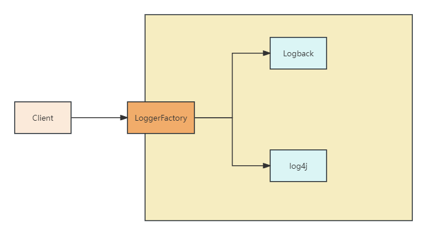

# slf4j
slf4j全称是Simple Java Logging Facade for Java，是一个为Java程序提供日志输出的统一接口，并不是一个具体的日志框架，类似于JDBC,
只是一种标准或准则。
SLF4J是典型的门面模式应用，它屏蔽了各种日志框架的差异，通过SLF4J提供的接口，可以很方便的切换到其他日志框架。

通过如下代码就可获取日志对象：
```java
import org.slf4j.Logger;
import org.slf4j.LoggerFactory;

public class MyClass {
    private static final Logger logger = LoggerFactory.getLogger(MyClass.class);

    public void myMethod() {
        logger.debug("Debug message");
        logger.info("Info message");
        logger.warn("Warn message");
        logger.error("Error message");
    }
}
```

# slf4j+Logback

